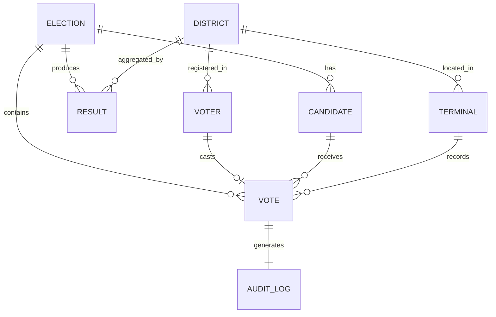

# Canonical Data Model Specification

## Data Glossary

This document defines the canonical data model for the Election Management System. All services must use these exact field names and types.

---

## 1. Elections

### Entity: Election
**Description:** Represents an electoral event

**Schema:**
```json
{
  "election_id": "uuid",
  "election_name": "string",
  "election_type": "enum[GENERAL, LOCAL, REFERENDUM, BY_ELECTION]",
  "description": "string",
  "start_date": "timestamp",
  "end_date": "timestamp",
  "status": "enum[SCHEDULED, ONGOING, COMPLETED, CANCELLED]",
  "region": "string",
  "total_registered_voters": "integer",
  "total_votes_cast": "integer",
  "created_at": "timestamp",
  "updated_at": "timestamp",
  "created_by": "uuid"
}
```

**Database:** PostgreSQL `elections` table  
**Blockchain:** Not stored (metadata only)  
**API:** `/api/v1/elections`

**Constraints:**
- `election_id`: Primary key, UUID v4
- `election_name`: Unique, max 200 chars
- `start_date` < `end_date`
- `status`: Auto-updates based on dates

---

## 2. Candidates

### Entity: Candidate
**Description:** Individuals running for election

**Schema:**
```json
{
  "candidate_id": "uuid",
  "election_id": "uuid",
  "candidate_name": "string",
  "party_name": "string",
  "party_symbol": "string",
  "age": "integer",
  "manifesto": "text",
  "photo_url": "string",
  "status": "enum[ACTIVE, WITHDRAWN, DISQUALIFIED]",
  "created_at": "timestamp",
  "updated_at": "timestamp"
}
```

**Database:** PostgreSQL `candidates` table  
**Blockchain:** Not stored  
**API:** `/api/v1/candidates`

**Constraints:**
- `candidate_id`: Primary key, UUID v4
- `election_id`: Foreign key → elections.election_id
- `age`: Must be ≥ 25 (for general elections)
- Unique (`election_id`, `candidate_name`)

---

## 3. Precincts / Districts

### Entity: District
**Description:** Geographic voting area

**Schema:**
```json
{
  "district_id": "uuid",
  "district_name": "string",
  "district_code": "string",
  "region": "string",
  "state": "string",
  "population": "integer",
  "registered_voters": "integer",
  "polling_stations": "integer",
  "coordinates": {
    "latitude": "float",
    "longitude": "float"
  },
  "created_at": "timestamp",
  "updated_at": "timestamp"
}
```

**Database:** PostgreSQL `districts` table  
**Blockchain:** Not stored  
**API:** `/api/v1/districts`

**Constraints:**
- `district_id`: Primary key, UUID v4
- `district_code`: Unique, 10 chars
- `registered_voters` ≤ `population`

---

## 4. Voters

### Entity: Voter
**Description:** Registered voter with biometric data

**Schema:**
```json
{
  "voter_id": "uuid",
  "aadhar_number": "string",
  "biometric_hash": "string",
  "district_id": "uuid",
  "first_name": "string",
  "last_name": "string",
  "date_of_birth": "date",
  "gender": "enum[M, F, OTHER]",
  "email": "string",
  "phone_number": "string",
  "status": "enum[ACTIVE, BLOCKED, PENDING]",
  "registration_date": "timestamp",
  "created_at": "timestamp",
  "updated_at": "timestamp"
}
```

**Database:** PostgreSQL `voters` table  
**Blockchain:** NOT stored (privacy)  
**API:** `/api/v1/voters` (admin only)

**Security:**
- `biometric_hash`: SHA-256 hash only, never store raw biometric
- `aadhar_number`: Encrypted at rest
- PII fields encrypted

**Constraints:**
- `voter_id`: Primary key, UUID v4
- `aadhar_number`: Unique, 12 digits
- `district_id`: Foreign key → districts.district_id
- Age must be ≥ 18 at election date

---

## 5. Devices / IoT Terminals

### Entity: IoTTerminal
**Description:** Physical voting device

**Schema:**
```json
{
  "terminal_id": "string",
  "mac_address": "string",
  "district_id": "uuid",
  "polling_station": "string",
  "firmware_version": "string",
  "hardware_version": "string",
  "status": "enum[ACTIVE, INACTIVE, MAINTENANCE, COMPROMISED]",
  "last_heartbeat": "timestamp",
  "battery_level": "integer",
  "tamper_seal_intact": "boolean",
  "total_votes_cast": "integer",
  "authorized": "boolean",
  "authorized_at": "timestamp",
  "created_at": "timestamp",
  "updated_at": "timestamp"
}
```

**Database:** MongoDB `iot_terminals` collection  
**Blockchain:** Terminal ID recorded with each vote  
**API:** `/api/v1/terminals`

**Constraints:**
- `terminal_id`: Primary key, format "TERM-XXXX-YYYY"
- `mac_address`: Unique, whitelisted
- `battery_level`: 0-100
- `tamper_seal_intact`: Must be true to allow voting

---

## 6. Ballots / Votes

### Entity: Vote
**Description:** Individual cast vote

**Schema (Application Layer):**
```json
{
  "vote_id": "uuid",
  "election_id": "uuid",
  "voter_id": "uuid",
  "candidate_id": "uuid",
  "district_id": "uuid",
  "terminal_id": "string",
  "biometric_hash": "string",
  "timestamp": "timestamp",
  "blockchain_tx_id": "string",
  "blockchain_block": "integer",
  "encrypted_vote_data": {
    "encrypted": "string",
    "iv": "string",
    "salt": "string",
    "tag": "string"
  },
  "zkp_commitment": "string",
  "receipt_hash": "string",
  "created_at": "timestamp"
}
```

**Database (PostgreSQL `voting_records`):**
- Stores: vote_id, election_id, voter_id, district_id, timestamp, blockchain_tx_id
- Does NOT store: actual vote (candidate_id) - on blockchain only

**Blockchain (Hyperledger Fabric):**
- Stores: Encrypted vote data, ZKP commitment
- Key: vote_id
- Privacy: voter_id ≠ candidate_id (separated)

**API:** `/api/v1/votes/cast` (POST only), `/api/v1/votes/verify` (GET with receipt)

**Security:**
- Vote content encrypted with election-specific key
- Voter identity never linked to vote on blockchain
- ZKP allows verification without disclosure

**Constraints:**
- One vote per (voter_id, election_id) - enforced by blockchain
- `vote_id`: Primary key, UUID v4
- All foreign keys validated before blockchain write

---

## 7. Results

### Entity: ElectionResult
**Description:** Aggregated election outcomes

**Schema:**
```json
{
  "result_id": "uuid",
  "election_id": "uuid",
  "candidate_id": "uuid",
  "district_id": "uuid",
  "vote_count": "integer",
  "percentage": "float",
  "rank": "integer",
  "result_type": "enum[PRELIMINARY, FINAL, RECOUNT]",
  "calculated_at": "timestamp",
  "verified": "boolean",
  "verification_hash": "string"
}
```

**Database:** PostgreSQL `election_results` table  
**Blockchain:** Verification hash stored  
**API:** `/api/v1/results`

**Constraints:**
- Composite key: (election_id, candidate_id, district_id, result_type)
- Sum of all vote_counts must equal total votes in election
- Percentages must sum to 100%

---

## 8. Audit Logs

### Entity: AuditLog
**Description:** Comprehensive activity log

**Schema:**
```json
{
  "_id": "objectId",
  "log_id": "uuid",
  "event_type": "enum[VOTE_CAST, VOTER_REGISTERED, LOGIN, ...]",
  "user_id": "string",
  "user_role": "enum[VOTER, ADMIN, OBSERVER, AUDITOR]",
  "timestamp": "timestamp",
  "ip_address": "string",
  "terminal_id": "string",
  "success": "boolean",
  "error_message": "string",
  "metadata": "object",
  "blockchain_tx_id": "string",
  "session_id": "string"
}
```

**Database:** MongoDB `audit_logs` collection  
**Blockchain:** NOT stored (too verbose)  
**API:** `/api/v1/audit`

**Indexes:**
- `event_type` + `timestamp`
- `user_id` + `timestamp`
- `terminal_id` + `timestamp`

---

## Field Name Standards

### Naming Conventions

**IDs:**
- Always use `<entity>_id` format
- Type: UUID v4 (string representation)
- Example: `voter_id`, `election_id`, `candidate_id`

**Timestamps:**
- Use `_at` suffix
- Format: ISO 8601 (`2024-02-09T01:30:00Z`)
- Fields: `created_at`, `updated_at`, `deleted_at`, `verified_at`

**Enums:**
- UPPERCASE_SNAKE_CASE
- Example: `ONGOING`, `ACTIVE`, `COMPLETED`

**Booleans:**
- Positive phrasing: `is_active`, `has_voted`, `authorized`
- Never: `not_active`, `disabled`

**Hashes:**
- Use `_hash` suffix
- Example: `biometric_hash`, `receipt_hash`, `verification_hash`
- Algorithm: SHA-256 (64-char hex)

**Encrypted Data:**
- Use `encrypted_` prefix
- Include: `encrypted`, `iv`, `salt`, `tag` fields
- Algorithm: AES-256-GCM

---

## Data Type Mappings

### PostgreSQL → JSON API → Blockchain

| Concept | PostgreSQL | JSON API | Blockchain (Fabric) |
|---------|-----------|----------|---------------------|
| ID | UUID | string | string |
| Name | VARCHAR(200) | string | string |
| Description | TEXT | string | string |
| Timestamp | TIMESTAMPTZ | string (ISO 8601) | int64 (epoch ms) |
| Enum | VARCHAR(50) | string | string |
| Boolean | BOOLEAN | boolean | bool |
| Integer | INTEGER | number | int32 |
| Float | NUMERIC | number | float64 |
| JSON | JSONB | object | string (serialized) |

---

## Cross-Service Data Consistency

### Shared Enums

**Election Status:**
```
SCHEDULED | ONGOING | COMPLETED | CANCELLED
```

**Voter Status:**
```
ACTIVE | BLOCKED | PENDING
```

**Terminal Status:**
```
ACTIVE | INACTIVE | MAINTENANCE | COMPROMISED
```

**Result Type:**
```
PRELIMINARY | FINAL | RECOUNT
```

**Event Type (Audit):**
```
VOTE_CAST | VOTER_REGISTERED | VOTER_AUTHENTICATED |
ELECTION_CREATED | CANDIDATE_ADDED | TERMINAL_AUTHORIZED |
FRAUD_DETECTED | ADMIN_LOGIN | OBSERVER_ACCESS |
BLOCKCHAIN_WRITE | BLOCKCHAIN_READ | RECOUNT_INITIATED
```

---

## Validation Rules

### Universal Rules

1. **UUIDs:** Always v4, lowercase with hyphens
2. **Timestamps:** Always UTC, ISO 8601
3. **Emails:** RFC 5322 compliant
4. **Phone:** E.164 format (+CCNNNNNNNNN)
5. **Names:** 2-100 characters, Unicode allowed
6. **IDs:** Never null, never reused

### Entity-Specific Rules

**Voter:**
- Age ≥ 18 at election date
- Aadhar: Exactly 12 digits
- One biometric per voter

**Vote:**
- Must be during election period
- Voter must be in same district as terminal
- One vote per voter per election

**Terminal:**
- MAC address must be whitelisted
- Battery ≥ 20% to accept votes
- Tamper seal must be intact

---

## Data Relationships



---

## API-Database-Blockchain Mapping

| Entity | PostgreSQL | MongoDB | Blockchain | API Endpoint |
|--------|-----------|---------|------------|--------------|
| Election | ✅ Full | ❌ | ❌ | /elections |
| Candidate | ✅ Full | ❌ | ❌ | /candidates |
| District | ✅ Full | ❌ | ❌ | /districts |
| Voter | ✅ Full | ❌ | ❌ | /voters |
| Terminal | ❌ | ✅ Full | ❌ | /terminals |
| Vote | ⚠️ Metadata | ❌ | ✅ Full | /votes |
| Result | ✅ Full | ❌ | ⚠️ Hash | /results |
| AuditLog | ❌ | ✅ Full | ❌ | /audit |

**Legend:**
- ✅ Full: Complete record stored
- ⚠️ Metadata: Partial data (no vote content)
- ❌: Not stored

---

## Validation Checklist

- [x] All entities have unique ID fields
- [x] Field naming is consistent across services
- [x] No conflicting field names
- [x] Enum values standardized
- [x] Data types mapped across platforms
- [x] Relationships clearly defined
- [x] Security considerations documented
- [x] API-DB-Blockchain mapping complete

---

**Document Version:** 1.0  
**Last Updated:** February 2024  
**Status:** ✅ Complete
