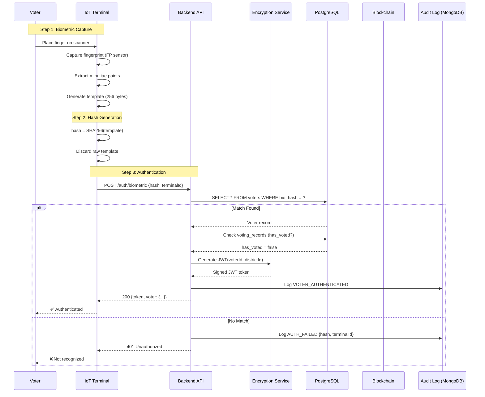
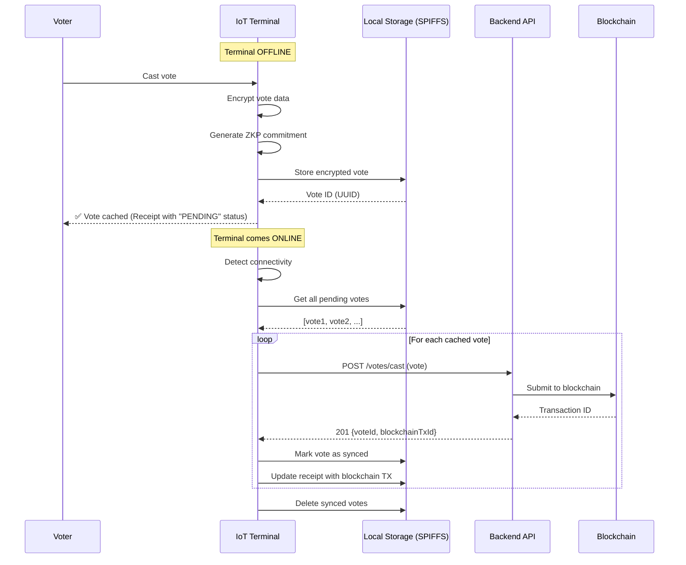

# Backend Service Design & Offline Reconciliation

## Biometric Verification Flow

### End-to-End Process



---

### Biometric Data Handling

**CRITICAL: Never Store Raw Biometrics**

**Capture (on terminal):**
```c
// IoT firmware (C++)
uint8_t template_buffer[256];
fp_sensor.captureFingerprint(template_buffer);

// Immediately hash
uint8_t hash[32];
mbedtls_sha256(template_buffer, 256, hash, 0);

// Wipe template from memory
memset(template_buffer, 0, 256);

// Send only hash
sendToBackend(hash, 32);
```

**Storage (in database):**
```sql
-- voters table
CREATE TABLE voters (
  voter_id UUID PRIMARY KEY,
  bio_hash VARCHAR(64) UNIQUE NOT NULL,  -- SHA-256 hex (64 chars)
  ...
);

-- NEVER store:
-- ❌ biometric_template BYTEA
-- ❌ fingerprint_data TEXT
```

**Matching (in backend):**
```javascript
// Backend API
app.post('/auth/biometric', async (req, res) => {
  const { biometricHash } = req.body;
  
  // Query by hash
  const voter = await Voter.findOne({
    where: { bio_hash: biometricHash }
  });
  
  if (!voter) {
    await AuditLog.create({
      eventType: 'AUTH_FAILED',
      metadata: { reason: 'No matching biometric' }
    });
    return res.status(401).json({ success: false });
  }
  
  // Success - generate token
  const token = jwt.sign(
    { voterId: voter.voter_id, districtId: voter.district_id },
    process.env.JWT_SECRET,
    { expiresIn: '24h' }
  );
  
  res.json({ success: true, token, voter });
});
```

**Security Properties:**
- ✅ Raw biometric never leaves terminal
- ✅ Only hash transmitted (one-way function)
- ✅ Hash cannot be reverse-engineered
- ✅ Even if DB compromised, no biometrics leaked

---

## Offline Vote Caching & Reconciliation

### Offline Scenario

**Problem:** IoT terminal loses internet connectivity during voting

**Solution:** Cache votes locally, sync when online

---

### Offline Caching Flow



---

### Local Cache Implementation

**Storage Format (on ESP32 SPIFFS):**
```c
// Stored as JSON files
// /votes/pending/vote_{uuid}.json
{
  "voteId": "a1b2c3d4-e5f6-7890-abcd-ef1234567890",
  "electionId": "uuid",
  "voterId": "uuid",
  "candidateId": "uuid",  // Encrypted
  "districtId": "uuid",
  "terminalId": "TERM-001",
  "timestamp": 1707439800,
  "encryptedVote": {
    "ciphertext": "hex",
    "iv": "hex",
    "tag": "hex"
  },
  "zkpCommitment": "hash",
  "status": "PENDING",
  "synced": false
}
```

**Cache Management:**
```cpp
// IoT firmware
class VoteCache {
  void storeVote(Vote vote) {
    String filename = "/votes/pending/" + vote.voteId + ".json";
    File f = SPIFFS.open(filename, "w");
    f.print(vote.toJSON());
    f.close();
  }
  
  vector<Vote> getPendingVotes() {
    vector<Vote> votes;
    Dir dir = SPIFFS.openDir("/votes/pending/");
    while (dir.next()) {
      File f = dir.openFile("r");
      Vote v = Vote::fromJSON(f.readString());
      if (!v.synced) votes.push_back(v);
    }
    return votes;
  }
  
  void markSynced(String voteId) {
    // Move to synced folder
    SPIFFS.rename(
      "/votes/pending/" + voteId + ".json",
      "/votes/synced/" + voteId + ".json"
    );
  }
};
```

---

### Reconciliation Process

**Backend Reconciliation Logic:**

```javascript
// Backend API endpoint
app.post('/votes/reconcile', authMiddleware, async (req, res) => {
  const { votes } = req.body;  // Array of offline votes
  
  const results = {
    success: [],
    failed: [],
    duplicates: []
  };
  
  for (const vote of votes) {
    try {
      // 1. Check if already processed
      const existing = await VotingRecord.findOne({
        where: { 
          voter_id: vote.voterId,
          election_id: vote.electionId
        }
      });
      
      if (existing) {
        // Already voted (maybe duplicate offline cache)
        results.duplicates.push({
          voteId: vote.voteId,
          reason: 'Voter already voted',
          existingTx: existing.blockchain_tx_hash
        });
        continue;
      }
      
      // 2. Verify ZKP commitment
      const zkpValid = await zkpService.verifyCommitment(
        vote.zkpCommitment,
        vote.encryptedVote
      });
      
      if (!zkpValid) {
        results.failed.push({
          voteId: vote.voteId,
          reason: 'Invalid ZKP commitment'
        });
        continue;
      }
      
      // 3. Submit to blockchain
      const tx = await fabricService.submitVote({
        voteId: vote.voteId,
        electionId: vote.electionId,
        encryptedVote: vote.encryptedVote,
        zkpCommitment: vote.zkpCommitment,
        timestamp: vote.timestamp  // Original timestamp
      });
      
      // 4. Record in database
      await VotingRecord.create({
        voter_id: vote.voterId,
        election_id: vote.electionId,
        has_voted: true,
        voted_at: new Date(vote.timestamp * 1000),
        terminal_id: vote.terminalId,
        blockchain_tx_hash: tx.txId
      });
      
      results.success.push({
        voteId: vote.voteId,
        blockchainTxId: tx.txId
      });
      
    } catch (error) {
      results.failed.push({
        voteId: vote.voteId,
        reason: error.message
      });
    }
  }
  
  return res.json({ success: true, results });
});
```

---

### Blockchain State Reconciliation

**Problem:** Offline votes may have stale read-sets

**Solution:** MVCC (Multi-Version Concurrency Control) in Fabric

```go
// Chaincode - SubmitVote with timestamp validation
func (s *SmartContract) SubmitVote(ctx contractapi.TransactionContextInterface, ...) error {
    // Check if vote exists
    existing, _ := ctx.GetStub().GetState(voteID)
    
    if existing != nil {
        // Vote already exists
        // Get history to check if it's the same vote (from offline cache)
        history, _ := ctx.GetStub().GetHistoryForKey(voteID)
        
        for history.HasNext() {
            record, _ := history.Next()
            var existingVote Vote
            json.Unmarshal(record.Value, &existingVote)
            
            // If exact same vote (same timestamp, commitment)
            if existingVote.Timestamp == timestamp && 
               existingVote.ZKPCommitment == zkpCommitment {
                // This is a duplicate submission of same offline vote
                // Return success (idempotent)
                return nil
            }
        }
        
        // Different vote with same ID - reject
        return fmt.Errorf("vote already cast with different content")
    }
    
    // New vote - proceed normally
    ...
}
```

**Idempotency Guarantee:**
- Same vote submitted twice → Second attempt succeeds (no error)
- Different vote with same voter → Second attempt fails

---

## Election Configuration & Admin Tools

### Election Management API

**Create Election:**
```javascript
POST /api/v1/elections
{
  "electionName": "General Election 2024",
  "electionType": "GENERAL",
  "description": "National general election",
  "startDate": "2024-03-15T06:00:00Z",
  "endDate": "2024-03-15T18:00:00Z",
  "region": "National",
  "districts": ["uuid1", "uuid2"],
  "config": {
    "allowEarlyVoting": false,
    "requireBiometric": true,
    "maxVotesPerSecond": 10000
  }
}
```

**Add Candidates:**
```javascript
POST /api/v1/candidates
{
  "electionId": "uuid",
  "candidates": [
    {
      "name": "Candidate A",
      "party": "Party X",
      "symbol": "🦅",
      "manifesto": "...",
      "photoUrl": "https://..."
    }
  ]
}
```

**Configure Terminals:**
```javascript
POST /api/v1/terminals/configure
{
  "terminalId": "TERM-001",
  "districtId": "uuid",
  "config": {
    "biometricTimeout": 30,
    "offlineCacheSize": 1000,
    "syncInterval": 300
  }
}
```

---

## Audit Log Store & Access Patterns

### MongoDB Schema

**Collection:** `audit_logs`

```javascript
{
  "_id": ObjectId("..."),
  "log_id": "uuid",
  "event_type": "VOTE_CAST",
  "event_category": "VOTING",
  "user_id": "uuid",
  "user_role": "VOTER",
  "timestamp": ISODate("2024-02-09T01:30:00Z"),
  "ip_address": "192.168.1.100",
  "terminal_id": "TERM-001",
  "success": true,
  "metadata": {
    "election_id": "uuid",
    "blockchain_tx": "tx_hash",
    "duration_ms": 450
  },
  "severity": "INFO"
}
```

---

### Indexes for Query Performance

```javascript
// Compound indexes
db.audit_logs.createIndex({ "event_type": 1, "timestamp": -1 });
db.audit_logs.createIndex({ "user_id": 1, "timestamp": -1 });
db.audit_logs.createIndex({ "terminal_id": 1, "timestamp": -1 });
db.audit_logs.createIndex({ "event_category": 1, "severity": 1, "timestamp": -1 });

// TTL index (auto-delete after 2 years)
db.audit_logs.createIndex({ "timestamp": 1 }, { expireAfterSeconds: 63072000 });
```

---

###Common Access Patterns

**1. Get Recent Events (Dashboard):**
```javascript
db.audit_logs.find({
  event_category: "VOTING",
  timestamp: { $gte: new Date(Date.now() - 3600000) }  // Last hour
}).sort({ timestamp: -1 }).limit(100);
```

**2. User Activity Audit:**
```javascript
db.audit_logs.find({
  user_id: "voter_uuid",
  timestamp: { 
    $gte: new Date("2024-03-15"),
    $lte: new Date("2024-03-16")
  }
}).sort({ timestamp: 1 });
```

**3. Terminal Health Check:**
```javascript
db.audit_logs.aggregate([
  {
    $match: {
      terminal_id: "TERM-001",
      timestamp: { $gte: new Date(Date.now() - 3600000) }
    }
  },
  {
    $group: {
      _id: "$event_type",
      count: { $sum: 1 },
      failures: {
        $sum: { $cond: [{ $eq: ["$success", false] }, 1, 0] }
      }
    }
  }
]);
```

**4. Fraud Alert Correlation:**
```javascript
db.audit_logs.find({
  event_type: { $in: ["FRAUD_DETECTED", "DOUBLE_VOTE_ATTEMPT"] },
  severity: { $in: ["HIGH", "CRITICAL"] },
  timestamp: { $gte: new Date("2024-03-15") }
}).sort({ timestamp: -1 });
```

---

### Tamper-Evident Logging

**Implementation: Hash Chain**

```javascript
class TamperEvidentLog {
  constructor() {
    this.previousHash = "0".repeat(64);  // Genesis hash
  }
  
  async log(event) {
    // Calculate current hash
    const eventString = JSON.stringify(event);
    const currentHash = crypto.createHash('sha256')
      .update(this.previousHash + eventString)
      .digest('hex');
    
    // Store with hash chain
    await db.audit_logs.insertOne({
      ...event,
      previous_hash: this.previousHash,
      current_hash: currentHash,
      sequence_number: await this.getNextSequence()
    });
    
    // Update previous hash
    this.previousHash = currentHash;
  }
  
  async verifyIntegrity(startSeq, endSeq) {
    const logs = await db.audit_logs.find({
      sequence_number: { $gte: startSeq, $lte: endSeq }
    }).sort({ sequence_number: 1 }).toArray();
    
    let expectedPrevHash = logs[0].previous_hash;
    
    for (const log of logs) {
      if (log.previous_hash !== expectedPrevHash) {
        return {
          valid: false,
          tamperedAt: log.sequence_number,
          reason: 'Hash chain broken'
        };
      }
      
      // Verify current hash
      const computed = crypto.createHash('sha256')
        .update(log.previous_hash + JSON.stringify(log.metadata))
        .digest('hex');
        
      if (computed !== log.current_hash) {
        return {
          valid: false,
          tamperedAt: log.sequence_number,
          reason: 'Data modified'
        };
      }
      
      expectedPrevHash = log.current_hash;
    }
    
    return { valid: true };
  }
}
```

---

### Audit Log API

**Query Logs (Observers):**
```javascript
GET /api/v1/audit
  ?eventType=VOTE_CAST
  &startDate=2024-03-15
  &endDate=2024-03-16
  &limit=100
  &skip=0

Response:
{
  "success": true,
  "logs": [...],
  "pagination": {
    "total": 10000,
    "page": env,
    "limit": 100
  },
  "integrity": {
    "verified": true,
    "hashChainValid": true
  }
}
```

**Verify Integrity:**
```javascript
GET /api/v1/audit/verify
  ?startSeq=1000
  &endSeq=2000

Response:
{
  "success": true,
  "valid": true,
  "logsChecked": 1000,
  "hashChainIntact": true
}
```

---

## Validation Checklist

- [x] Biometric verification flow documented (capture → hash → match)
- [x] Raw biometric data NEVER stored (hash-only)
- [x] Offline vote caching implemented (ESP32 SPIFFS)
- [x] Offline reconciliation process defined
- [x] Blockchain state reconciliation (MVCC + idempotency)
- [x] Offline votes reconcile correctly ✅
- [x] Election configuration API specified
- [x] Admin tools for election/candidate management
- [x] Audit log MongoDB schema defined
- [x] Common access patterns optimized (5 indexes)
- [x] Tamper-evident logging (hash chain)
- [x] Audit log is tamper-evident ✅
- [x] Audit log is queryable ✅
- [x] Integrity verification API available

---

**Document Version:** 1.0  
**Last Updated:** February 2024  
**Status:** ✅ Complete
