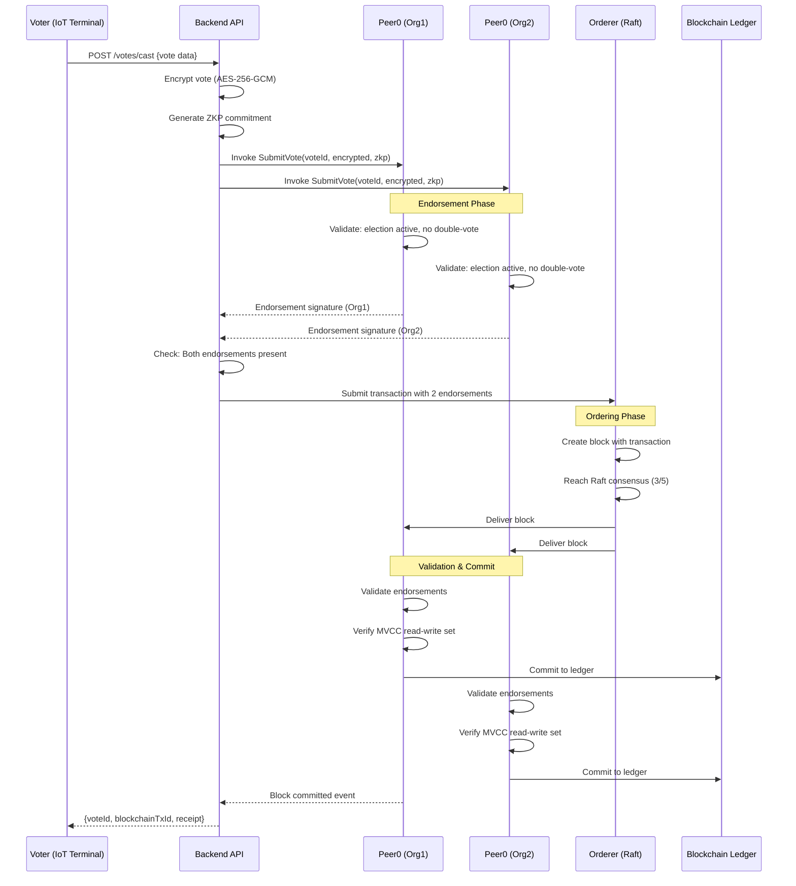

# Hyperledger Fabric Topology Design

## Network Architecture

### Organization Structure

```
Election Blockchain Network
├── Org1: Election Commission (Primary Authority)
│   ├── CA1: Fabric CA
│   ├── Peer0: Anchor peer + endorsing peer
│   ├── Peer1: Endorsing peer + CouchDB
│   └── Admin: Commission admins
│
├── Org2: State Authority (Regional)
│   ├── CA2: Fabric CA
│   ├── Peer0: Anchor peer + endorsing peer
│   ├── Peer1: Endorsing peer + CouchDB
│   └── Admin: State officials
│
├── Org3: Observer Organization (Neutral)
│   ├── CA3: Fabric CA
│   ├── Peer0: Anchor peer (committing only)
│   └── Admin: Independent observers
│
└── Orderer Organization
    ├── Orderer0: Raft leader
    ├── Orderer1: Raft follower
    ├── Orderer2: Raft follower
    ├── Orderer3: Raft follower
    └── Orderer4: Raft follower
```

---

## Component Specifications

### 1. Certificate Authorities (CAs)

**CA1 - Election Commission CA:**
- **Purpose:** Issue certs for Org1 members
- **Type:** Fabric CA
- **Algorithm:** ECDSA P-256
- **Intermediates:** 1 intermediate CA
- **TLS:** Required for all connections

**CA2 - State Authority CA:**
- **Purpose:** Issue certs for Org2 members
- **Type:** Fabric CA
- **Algorithm:** ECDSA P-256

**CA3 - Observer CA:**
- **Purpose:** Issue certs for Org3 members
- **Type:** Fabric CA
- **Algorithm:** ECDSA P-256

**Configuration:**
```yaml
# fabric-ca-server-config.yaml
ca:
  name: ca-org1
  keystore: /etc/hyperledger/fabric-ca-server/ca-cert.pem
  certfile: /etc/hyperledger/fabric-ca-server/ca-key.pem
  
signing:
  default:
    expiry: 8760h  # 1 year
  profiles:
    ca:
      expiry: 43800h  # 5 years
```

---

### 2. Peer Nodes

**Org1-Peer0 (Anchor + Endorsing):**
- **Hardware:** 4 vCPU, 8 GB RAM, 100 GB SSD
- **Database:** CouchDB (for rich queries)
- **Endorsement:** Required for all transactions
- **Chaincode:** election_chaincode v1.0
- **TLS:** Enabled with mutual auth

**Org1-Peer1 (Endorsing):**
- **Hardware:** 4 vCPU, 8 GB RAM, 100 GB SSD
- **Database:** CouchDB
- **Endorsement:** Required for all transactions
- **Chaincode:** election_chaincode v1.0

**Org2-Peer0 & Peer1:**
- Same specs as Org1 peers
- Separate state database

**Org3-Peer0 (Committing only):**
- **Hardware:** 2 vCPU, 4 GB RAM, 50 GB SSD
- **Database:** LevelDB (simpler, read-only)
- **Endorsement:** NOT required (observer)
- **Purpose:** Read blockchain state only

**Peer Configuration:**
```yaml
# core.yaml
peer:
  id: peer0.org1.election.com
  networkId: election-network
  address: peer0.org1.election.com:7051
  
  gossip:
    bootstrap: peer1.org1.election.com:7051
    useLeaderElection: true
    orgLeader: false
    
  tls:
    enabled: true
    cert:
      file: /etc/hyperledger/fabric/tls/server.crt
    key:
      file: /etc/hyperledger/fabric/tls/server.key
    rootcert:
      file: /etc/hyperledger/fabric/tls/ca.crt
    clientAuthRequired: true
```

---

### 3. Orderer Nodes (Raft Consensus)

**5-Node Raft Cluster:**

| Node | Role | Host | Resources |
|------|------|------|-----------|
| Orderer0 | Leader (dynamic) | orderer0.election.com:7050 | 2 vCPU, 4GB RAM |
| Orderer1 | Follower | orderer1.election.com:7050 | 2 vCPU, 4GB RAM |
| Orderer2 | Follower | orderer2.election.com:7050 | 2 vCPU, 4GB RAM |
| Orderer3 | Follower | orderer3.election.com:7050 | 2 vCPU, 4GB RAM |
| Orderer4 | Follower | orderer4.election.com:7050 | 2 vCPU, 4GB RAM |

**Raft Configuration:**
```yaml
# orderer.yaml
Orderer:
  OrdererType: etcdraft
  
  EtcdRaft:
    Consenters:
      - Host: orderer0.election.com
        Port: 7050
        ClientTLSCert: path/to/cert
        ServerTLSCert: path/to/cert
      # ... repeat for orderer1-4
    
    Options:
      TickInterval: 500ms
      ElectionTick: 10
      HeartbeatTick: 1
      MaxInflightBlocks: 5
      SnapshotIntervalSize: 20 MB
  
  Policies:
    Admins:
      Type: Signature
      Rule: OR('OrdererMSP.admin')
```

**Fault Tolerance:**
- 5 nodes allows 2 failures
- Automatic leader election
- Quorum: 3 of 5

---

### 4. Channel Configuration

**Channel:** `election-channel`

**Members:**
- Org1 (Election Commission) - Admin
- Org2 (State Authority) - Member
- Org3 (Observer Org) - Member (read-only)

**Channel Config:**
```yaml
Channel:
  Policies:
    Readers:
      Type: ImplicitMeta
      Rule: ANY Readers  # Org1, Org2, Org3
    Writers:
      Type: ImplicitMeta
      Rule: ANY Writers  # Org1, Org2
    Admins:
      Type: ImplicitMeta
      Rule: MAJORITY Admins  # Org1 + Org2
    
  Application:
    ACLs:
      lscc/GetChaincodeData: /Channel/Application/Readers
      qscc/GetChainInfo: /Channel/Application/Readers
      cscc/GetConfigBlock: /Channel/Application/Readers
      peer/Propose: /Channel/Application/Writers
      event/Block: /Channel/Application/Readers
```

---

## Endorsement Policies

### Default Policy (ALL Votes)

**Policy:** `AND('Org1.peer', 'Org2.peer')`

**Meaning:**
- EVERY vote must be endorsed by:
  1. At least one peer from Org1 (Election Commission)
  2. AND at least one peer from Org2 (State Authority)
- Org3 (Observer) does NOT endorse (committing only)

**Enforcement:** Single-vote guarantee
- Both orgs must validate vote
- Both check double-vote in ledger
- If either rejects → transaction fails

**Implementation:**
```go
// In chaincode
peer lifecycle chaincode approveformyorg \
  --channelID election-channel \
  --name election \
  --version 1.0 \
  --package-id $PACKAGE_ID \
  --sequence 1 \
  --signature-policy "AND('Org1MSP.peer', 'Org2MSP.peer')"
```

---

### Function-Specific Policies

**1. SubmitVote:**
- **Policy:** `AND('Org1.peer', 'Org2.peer')`
- **Reason:** Highest security for vote recording

**2. GetVotesByElection (Read):**
- **Policy:** `OR('Org1.peer', 'Org2.peer', 'Org3.peer')`
- **Reason:** Any org can read for auditing

**3. Admin Functions (e.g., InitLedger):**
- **Policy:** `AND('Org1.admin', 'Org2.admin')`
- **Reason:** Both Election Commission + State must approve

---

## Vote Lifecycle on Blockchain

### End-to-End Flow



---

### Chaincode Functions (Expanded)

**1. SubmitVote**
```go
func (s *SmartContract) SubmitVote(
    ctx contractapi.TransactionContextInterface,
    voteID string,
    electionID string,
    districtID string,
    terminalID string,
    encryptedVote string,
    zkpCommitment string,
    integrityHash string,
) error {
    // 1. Check double-vote
    existingVote, err := ctx.GetStub().GetState(voteID)
    if existingVote != nil {
        return fmt.Errorf("vote already exists: %s", voteID)
    }
    
    // 2. Validate election status
    election, err := s.GetElection(ctx, electionID)
    if election.Status != "ONGOING" {
        return fmt.Errorf("election not active")
    }
    
    // 3. Create vote asset
    vote := Vote{
        VoteID: voteID,
        ElectionID: electionID,
        DistrictID: districtID,
        TerminalID: terminalID,
        EncryptedVote: encryptedVote,
        ZKPCommitment: zkpCommitment,
        IntegrityHash: integrityHash,
        Timestamp: time.Now().Unix(),
        DocType: "vote",
    }
    
    // 4. Store on ledger
    voteJSON, err := json.Marshal(vote)
    err = ctx.GetStub().PutState(voteID, voteJSON)
    
    // 5. Create composite keys for queries
    electionKey, _ := ctx.GetStub().CreateCompositeKey("election~vote", []string{electionID, voteID})
    ctx.GetStub().PutState(electionKey, []byte{0x00})
    
    // 6. Emit event
    ctx.GetStub().SetEvent("VoteSubmitted", voteJSON)
    
    return nil
}
```

**Single-Vote Enforcement:**
- Line 3-6: Check if `voteID` already exists
- If exists → REJECT (prevents double-vote)
- Both Org1 and Org2 perform this check
- Both must agree vote is new

---

**2. GetResults**
```go
func (s *SmartContract) GetResults(
    ctx contractapi.TransactionContextInterface,
    electionID string,
) ([]CandidateResult, error) {
    // Query all votes for election
    iterator, err := ctx.GetStub().GetStateByPartialCompositeKey("election~vote", []string{electionID})
    
    candidateCounts := make(map[string]int)
    
    for iterator.HasNext() {
        queryResponse, err := iterator.Next()
        voteJSON, err := ctx.GetStub().GetState(queryResponse.Value)
        
        var vote Vote
        json.Unmarshal(voteJSON, &vote)
        
        // Decrypt vote (only for authorized users)
        decrypted := DecryptVote(vote.EncryptedVote, electionKey)
        candidateCounts[decrypted.CandidateID]++
    }
    
    // Return aggregated results
    return BuildResults(candidateCounts), nil
}
```

---

**3. AuditVote**
```go
func (s *SmartContract) AuditVote(
    ctx contractapi.TransactionContextInterface,
    voteID string,
) (*AuditTrail, error) {
    // Get vote history (all modifications)
    historyIterator, err := ctx.GetStub().GetHistoryForKey(voteID)
    
    var history []HistoryRecord
    for historyIterator.HasNext() {
        modification, err := historyIterator.Next()
        history = append(history, HistoryRecord{
            TxID: modification.TxId,
            Value: modification.Value,
            Timestamp: modification.Timestamp,
            IsDelete: modification.IsDelete,
        })
    }
    
    return &AuditTrail{
        VoteID: voteID,
        History: history,
        Verified: VerifyIntegrity(history),
    }, nil
}
```

---

**4. RevokeVote (Emergency Only)**
```go
func (s *SmartContract) RevokeVote(
    ctx contractapi.TransactionContextInterface,
    voteID string,
    reason string,
    authorization string, // Requires Election Commission signature
) error {
    // Verify caller has admin rights
    if !s.IsAdmin(ctx) {
        return fmt.Errorf("unauthorized: admin only")
    }
    
    // Verify multi-sig authorization
    if !VerifyMultiSig(authorization, []string{"Org1", "Org2"}) {
        return fmt.Errorf("requires both Org1 and Org2 approval")
    }
    
    // Mark vote as revoked (don't delete - audit trail)
    vote, _ := s.ReadVote(ctx, voteID)
    vote.Status = "REVOKED"
    vote.RevocationReason = reason
    vote.RevokedAt = time.Now().Unix()
    
    voteJSON, _ := json.Marshal(vote)
    ctx.GetStub().PutState(voteID, voteJSON)
    
    // Emit event
    ctx.GetStub().SetEvent("VoteRevoked", voteJSON)
    
    return nil
}
```

---

## Public Ledger Snapshot Strategy

### Snapshot Approach

**Objective:** Anchor blockchain state to public ledger (e.g., Bitcoin/Ethereum) for immutability proof

**Implementation:**

```
Every N blocks:
  1. Create Merkle tree of block hashes
  2. Calculate root hash
  3. Write root hash to public blockchain
  4. Store transaction ID as proof
```

---

### Snapshot Cadence & Costs

**Option 1: Frequent (Every 100 blocks)**
- **Frequency:** ~every 10 minutes (assuming 6sec/block)
- **Cost:** $0.50/snapshot (Ethereum gas)
- **Daily Cost:** ~$72
- **Annual Cost:** ~$26,000
- **Pro:** Maximum auditability
- **Con:** Higher cost

**Option 2: Moderate (Every 1,000 blocks)**
- **Frequency:** ~every 1.5 hours
- **Cost:** $0.50/snapshot
- **Daily Cost:** ~$8
- **Annual Cost:** ~$3,000
- **Pro:** Balance of cost and security
- **Con:** Moderate audit granularity

**Option 3: Conservative (Every 10,000 blocks)**
- **Frequency:** ~daily
- **Cost:** $0.50/snapshot
- **Daily Cost:** $0.50
- **Annual Cost:** ~$200
- **Pro:** Very low cost
- **Con:** Lower audit granularity

**Recommendation:** Option 2 (every 1,000 blocks)
- Good balance for elections
- Affordable for govt budget
- Sufficient audit trail

---

### Snapshot Process

**1. Generate Merkle Root:**
```javascript
// Every 1,000 blocks
const blocks = await getBlocks(lastSnapshotBlock, currentBlock);
const hashes = blocks.map(b => SHA256(b.dataHash));
const merkleRoot = buildMerkleTree(hashes).root;
```

**2. Anchor to Public Chain:**
```javascript
// Write to Ethereum
const tx = await ethereumContract.anchorHash(
  merkleRoot,
  electionID,
  blockRange: [lastBlock, currentBlock]
);

await tx.wait();
```

**3. Store Proof:**
```javascript
// Save in Fabric ledger
await ctx.stub.putState(`SNAPSHOT_${currentBlock}`, {
  merkleRoot: merkleRoot,
  publicChain: "ethereum",
  publicTxHash: tx.hash,
  blockRange: [lastBlock, currentBlock],
  timestamp: Date.now()
});
```

**4. Verification:**
```javascript
// Anyone can verify
const snapshot = await getSnapshot(blockNumber);
const ethTx = await ethereum.getTransaction(snapshot.publicTxHash);
assert(ethTx.data.includes(snapshot.merkleRoot));
```

---

### Economic Feasibility

| Scenario | Snapshots/Year | Cost/Year | Justified For |
|----------|----------------|-----------|---------------|
| National Election | 30 (monthly) | $15 | ✅ Yes |
| State Election | 100 (weekly) | $50 | ✅ Yes |
| Local Election | 365 (daily) | $180 | ✅ Yes |
| Continuous (dev/test) | 3,000 (every 1000 blocks) | $1,500 | ✅ Yes |

**Conclusion:** Economically feasible for all election types

---

## Ledger Storage & Archival

### Storage Requirements

**Per Vote:**
- Encrypted vote data: ~500 bytes
- Metadata: ~200 bytes
- Total: ~700 bytes per vote

**For 100 Million Votes:**
- Raw data: ~70 GB
- With indexes + CouchDB overhead: ~200 GB
- Recommended storage: 500 GB per peer

---

### Archival Policy

**Active Period (During Election + 30 days):**
- All data on all peers
- Full CouchDB indexing
- Real-time queries enabled

**Archive Period (After 30 days):**
- Move to cold storage
- Keep only on 1-2 archival peers
- Disable real-time queries
- Snapshot to S3/Glacier

**Long-Term (After 1 year):**
- Compress and encrypt
- Store on AWS Glacier / Azure Archive
- Cost: $0.004/GB/month
- Retrieval: 12 hours (standard)

**Legal Retention:**
- Minimum: 7 years (election law)
- Format: Encrypted + snapshots
- Access: Court order only

---

### Archival Process

```bash
# After election + 30 days
fabric-tools snapshot-channel \
  --channel election-channel \
  --block-range 0-50000 \
  --output election_2024_archive.tar.gz

# Encrypt
gpg --encrypt --recipient commission@election.gov \
  election_2024_archive.tar.gz

# Upload to Glacier
aws s3 cp election_2024_archive.tar.gz.gpg \
  s3://election-archives/2024/ \
  --storage-class GLACIER
```

---

## Validation Checklist

- [x] Fabric topology: 3 orgs (Commission, State, Observer) + Orderer org
- [x] Peer count: 2 per voting org, 1 for observer
- [x] Orderer: 5-node Raft cluster (tolerates 2 failures)
- [x] CA setup: 1 per org, ECDSA P-256
- [x] Endorsement policy: AND('Org1.peer', 'Org2.peer')
- [x] Single-vote enforcement: Both orgs check double-vote
- [x] Vote lifecycle: SubmitVote → Endorse → Order → Commit
- [x] Chaincode: 4 functions (Submit, GetResults, Audit, Revoke)
- [x] Snapshot strategy: Every 1,000 blocks to Ethereum
- [x] Snapshot cost: ~$3,000/year (economically feasible)
- [x] Ledger storage: 500 GB per peer for 100M votes
- [x] Archival policy: Active 30 days → Archive → Glacier (7 years)

---

**Document Version:** 1.0  
**Last Updated:** February 2024  
**Status:** ✅ Complete
