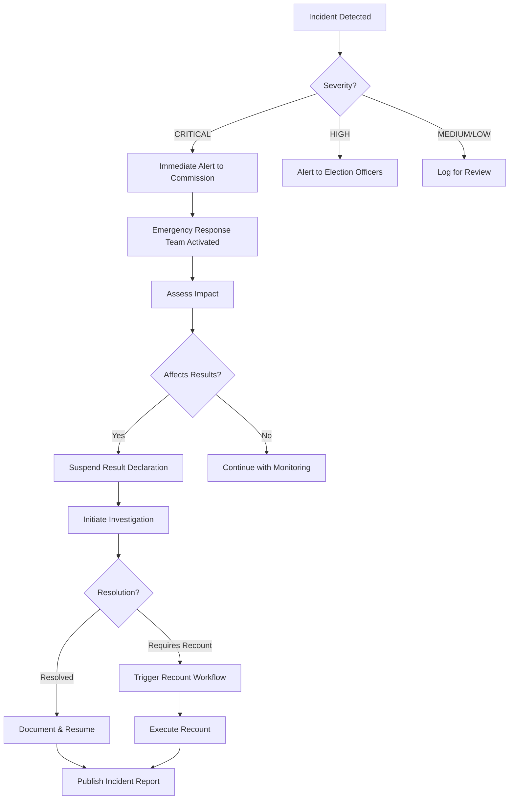

# Production Enhancements for Real-Life Usage

## Overview

This document specifies recommended enhancements to make the Election Management System production-ready for real-world deployment at scale.

---

## 1. Election Configuration Portal (Officials)

### Purpose
Web-based portal for election officials to create elections, manage candidates, configure settings, and control poll operations.

### User Roles
- **Election Commissioner:** Full control, can certify results
- **Election Officer:** Create/manage elections, candidates
- **Poll Manager:** Open/close polls, monitor terminals
- **Data Entry Clerk:** Add voter registrations, candidates

---

### Features

#### 1.1 Create Election Wizard

```
┌─────────────────────────────────────────────┐
│  Create New Election - Step 1 of 4          │
├─────────────────────────────────────────────┤
│                                             │
│  Election Details:                          │
│  ┌─────────────────────────────────────┐   │
│  │ Name: General Election 2024         │   │
│  └─────────────────────────────────────┘   │
│                                             │
│  Type: ○ General  ● State  ○ Local        │
│                                             │
│  Start: [2024-03-15] [06:00 AM]            │
│  End:   [2024-03-15] [06:00 PM]            │
│                                             │
│  Description:                               │
│  ┌─────────────────────────────────────┐   │
│  │ [Multi-line text area]               │   │
│  └─────────────────────────────────────┘   │
│                                             │
│         [Cancel]  [Next: Districts →]      │
└─────────────────────────────────────────────┘
```

**Step 2: Select Districts**
```
┌─────────────────────────────────────────────┐
│  Create New Election - Step 2 of 4          │
├─────────────────────────────────────────────┤
│  Select Districts:                          │
│                                             │
│  ☑ Mumbai Central (234,567 voters)         │
│  ☑ Mumbai North (187,234 voters)           │
│  ☐ Pune West (156,789 voters)              │
│  ☐ Nagpur East (98,456 voters)             │
│                                             │
│  Selected: 2 districts, 421,801 voters     │
│                                             │
│  [← Back]  [Cancel]  [Next: Candidates →] │
└─────────────────────────────────────────────┘
```

**Step 3: Add Candidates**
```
┌─────────────────────────────────────────────┐
│  Create New Election - Step 3 of 4          │
├─────────────────────────────────────────────┤
│  Candidates:                                │
│                                             │
│  ┌───────────────────────────────────────┐ │
│  │ 1. Candidate A (Party X) 🦅          │ │
│  │    [Edit] [Remove]                    │ │
│  ├───────────────────────────────────────┤ │
│  │ 2. Candidate B (Party Y) 🌸          │ │
│  │    [Edit] [Remove]                    │ │
│  └───────────────────────────────────────┘ │
│                                             │
│  [+ Add Candidate]                          │
│                                             │
│  [← Back]  [Cancel]  [Next: Review →]     │
└─────────────────────────────────────────────┘
```

**Step 4: Review & Publish**
```
┌─────────────────────────────────────────────┐
│  Create New Election - Step 4 of 4          │
├─────────────────────────────────────────────┤
│  Review Election:                           │
│                                             │
│  Name: General Election 2024                │
│  Date: March 15, 2024 (6 AM - 6 PM)        │
│  Districts: 2 (421,801 voters)             │
│  Candidates: 2                              │
│                                             │
│  ☑ I confirm all details are correct       │
│  ☑ I authorize this election               │
│                                             │
│  [← Back]  [Cancel]  [🚀 Publish Election]│
└─────────────────────────────────────────────┘
```

#### 1.2 API Implementation

```javascript
// POST /api/v1/elections
{
  "name": "General Election 2024",
  "type": "GENERAL",
  "startDate": "2024-03-15T06:00:00Z",
  "endDate": "2024-03-15T18:00:00Z",
  "description": "National general election",
  "districtIds": ["uuid1", "uuid2"],
  "candidates": [
    {
      "name": "Candidate A",
      "party": "Party X",
      "symbol": "🦅",
      "manifesto": "...",
      "photoUrl": "https://..."
    }
  ],
  "config": {
    "allowEarlyVoting": false,
    "requireBiometric": true,
    "maxVotesPerTerminal": 1000
  }
}
```

#### 1.3 Poll Control Dashboard

```
┌────────────────────────────────────────────────────┐
│  Election Control | General Election 2024          │
├────────────────────────────────────────────────────┤
│  Status: 🔴 SCHEDULED                              │
│  Date: March 15, 2024 | 6 AM - 6 PM               │
│  Voters: 421,801 | Terminals: 423                 │
├────────────────────────────────────────────────────┤
│                                                    │
│  Quick Actions:                                    │
│  ┌──────────────┐  ┌──────────────┐              │
│  │ 🟢 OPEN POLLS│  │ ⚙️ CONFIGURE  │              │
│  └──────────────┘  └──────────────┘              │
│                                                    │
│  ┌──────────────┐  ┌──────────────┐              │
│  │ 🔴 CLOSE     │  │ 📊 RESULTS    │              │
│  │    POLLS     │  │                │              │
│  └──────────────┘  └──────────────┘              │
│                                                    │
│  Terminal Status:                                 │
│  ✅ Online: 420 | ⚠️ Warning: 2 | ❌ Offline: 1  │
│                                                    │
│  Voting Progress:                                 │
│  [████████░░░░░░░░░░] 45% (189,810 votes)        │
│                                                    │
│  ⚠️ 3 Active Alerts  [VIEW ALERTS]               │
└────────────────────────────────────────────────────┘
```

**Open Polls Action:**
```javascript
// POST /api/v1/elections/{id}/open
{
  "openTime": "2024-03-15T06:00:00Z",
  "authorizedBy": "commissioner-id",
  "signature": "digital-signature"
}

// Activates all terminals
// Enables vote casting
// Broadcasts to all systems
```

**Close Polls Action:**
```javascript
// POST /api/v1/elections/{id}/close
{
  "closeTime": "2024-03-15T18:00:00Z",
  "authorizedBy": "commissioner-id",
  "signature": "digital-signature"
}

// Locks all terminals
// Disables new votes
// Triggers tally process
```

---

## 2. Voter Assistance Flow & Accessibility

### 2.1 Assistance Modes

**Mode 1: Voice-Guided (for visually impaired)**
```
Terminal detects headphone jack insertion
  ↓
Auto-enable voice guidance
  ↓
Read all text aloud
  ↓
Audio cues for button locations
  ↓
Confirm selections verbally
```

**Implementation:**
```javascript
class VoiceAssistant {
  enable() {
    this.audioEnabled = true;
    this.speak("Voice assistance enabled. Welcome to voting.");
    this.readScreen();
  }
  
  speak(text, lang = 'hi-IN') {
    const utterance = new SpeechSynthesisUtterance(text);
    utterance.lang = lang;
    utterance.rate = 0.8;  // Slower for clarity
    utterance.pitch = 1.0;
    speechSynthesis.speak(utterance);
  }
  
  readScreen() {
    const elements = document.querySelectorAll('[aria-label]');
    elements.forEach((el, index) => {
      this.speak(`Option ${index + 1}: ${el.getAttribute('aria-label')}`);
    });
  }
}
```

**Mode 2: Large Text (for low vision)**
```css
.large-text-mode {
  font-size: 200%; /* Double size */
  line-height: 1.5;
  font-weight: 600;
}

.large-text-mode .button {
  min-width: 150px;
  min-height: 150px;
  font-size: 48px;
}
```

**Mode 3: High Contrast (for color blindness)**
```css
.high-contrast-mode {
  background: #000;
  color: #FFFF00;  /* Yellow text */
}

.high-contrast-mode .button {
  border: 4px solid #FFFF00;
  background: #000;
}

.high-contrast-mode .button:hover {
  background: #FFFF00;
  color: #000;
}
```

**Mode 4: Simplified UI (for cognitive disabilities)**
```
One action per screen
Larger buttons (100x100px minimum)
Simple icons only
No time pressure
Repeat instructions
```

### 2.2 Assistance Call Button

```
┌─────────────────────────────────────┐
│                                      │
│     Need Help?                       │
│                                      │
│  ┌────────────────────────────────┐ │
│  │   🆘 CALL POLL WORKER          │ │
│  │                                 │ │
│  └────────────────────────────────┘ │
│                                      │
│  A poll worker will assist you      │
│                                      │
└─────────────────────────────────────┘
```

**Backend:**
```javascript
// Sends alert to poll worker tablet
POST /api/v1/terminals/{id}/assistance-request
{
  "terminalId": "TERM-001",
  "boothNumber": "12A",
  "timestamp": "2024-03-15T10:30:00Z",
  "reason": "VOTER_NEEDS_HELP"
}

// Poll worker gets notification
{
  "alert": "Voter needs assistance at Booth 12A, Terminal TERM-001",
  "location": "Building A, Floor 2",
  "distance": "50m"
}
```

---

## 3. Multi-Language Support (Enhanced)

### 3.1 Language Selection

**Pre-Login:**
```
┌─────────────────────────────────────┐
│   Select Your Language               │
│   अपनी भाषा चुनें                    │
│                                      │
│  ┌────────┐  ┌────────┐  ┌────────┐│
│  │        │  │        │  │        ││
│  │ हिंदी  │  │English │  │ தமிழ் ││
│  │        │  │        │  │        ││
│  └────────┘  └────────┘  └────────┘│
│                                      │
│  ┌────────┐  ┌────────┐  ┌────────┐│
│  │ తెలుగు │  │ বাংলা  │  │ मराठी ││
│  └────────┘  └────────┘  └────────┘│
│                                      │
│  ┌────────┐  ┌────────┐  ┌────────┐│
│  │ ગુજરાતી│  │ ಕನ್ನಡ  │  │ മലയാളം││
│  └────────┘  └────────┘  └────────┘│
└─────────────────────────────────────┘
```

### 3.2 Translation Management

**Admin Portal for Translations:**
```
┌─────────────────────────────────────────────┐
│  Translation Management                      │
├─────────────────────────────────────────────┤
│  Key: welcome_message                        │
│                                             │
│  English:                                   │
│  ┌─────────────────────────────────────┐   │
│  │ Welcome to voting                    │   │
│  └─────────────────────────────────────┘   │
│                                             │
│  Hindi (हिंदी):                            │
│  ┌─────────────────────────────────────┐   │
│  │ मतदान में आपका स्वागत है            │   │
│  └─────────────────────────────────────┘   │
│                                             │
│  Tamil (தமிழ்):                            │
│  ┌─────────────────────────────────────┐   │
│  │ [Translation needed]                 │   │
│  └─────────────────────────────────────┘   │
│                                             │
│  [Save]  [Auto-Translate]  [Preview]       │
└─────────────────────────────────────────────┘
```

**Auto-Translation API:**
```javascript
// Integration with Google Cloud Translation
async function autoTranslate(text, targetLang) {
  const [translation] = await translate.translate(text, targetLang);
  return translation;
}

// Bulk translate all missing keys
async function bulkTranslate(sourceLang, targetLang) {
  const keys = await getMissingTranslations(targetLang);
  
  for (const key of keys) {
    const sourceText = getTranslation(key, sourceLang);
    const translated = await autoTranslate(sourceText, targetLang);
    
    await saveTranslation(key, targetLang, translated, {
      autoGenerated: true,
      needsReview: true
    });
  }
}
```

### 3.3 Right-to-Left (RTL) Support

**For Urdu, Arabic languages:**
```css
[dir="rtl"] {
  direction: rtl;
  text-align: right;
}

[dir="rtl"] .button-row {
  flex-direction: row-reverse;
}

[dir="rtl"] .icon-left {
  margin-right: 0;
  margin-left: 8px;
}
```

---

## 4. Observers' Audit Package Export

### 4.1 Export Package Contents

**Structure:**
```
election-2024-audit-package/
├── metadata.json
├── election-config.json
├── results/
│   ├── summary.json
│   ├── district-breakdown.csv
│   └── terminal-level.csv
├── blockchain/
│   ├── block-hashes.json
│   ├── snapshot-proofs.json
│   └── merkle-tree.json
├── audit-logs/
│   ├── voting-events.csv
│   ├── fraud-alerts.csv
│   └── system-events.csv
├── verification/
│   ├── digital-signatures.json
│   ├── integrity-checksums.json
│   └── tamper-evidence-report.pdf
└── README.txt
```

### 4.2 Tamper-Evidence Report

**Auto-generated PDF:**
```
┌────────────────────────────────────────────┐
│  TAMPER-EVIDENCE REPORT                    │
│  Election: General Election 2024            │
│  Generated: March 16, 2024 02:00 AM        │
├────────────────────────────────────────────┤
│                                            │
│  1. BLOCKCHAIN INTEGRITY                   │
│     ✅ All 12,345 blocks verified          │
│     ✅ Hash chain intact                   │
│     ✅ No orphaned transactions            │
│                                            │
│  2. AUDIT LOG INTEGRITY                    │
│     ✅ All 1,234,567 log entries verified  │
│     ✅ Hash chain intact                   │
│     ✅ No tampering detected               │
│                                            │
│  3. DIGITAL SIGNATURES                     │
│     ✅ Election opening: VALID             │
│     ✅ Election closing: VALID             │
│     ✅ Result certification: VALID         │
│                                            │
│  4. SNAPSHOT VERIFICATION                  │
│     ✅ 12 snapshots on Ethereum            │
│     ✅ All Merkle roots match              │
│     TX: 0xAB12CD34... (Block 15678902)    │
│                                            │
│  5. TERMINAL INTEGRITY                     │
│     ✅ 423 terminals verified              │
│     ✅ No tamper alerts                    │
│     ✅ All certificates valid              │
│                                            │
│  CONCLUSION: ✅ NO TAMPERING DETECTED      │
│                                            │
│  Digital Signature:                        │
│  [QR Code]                                 │
│                                            │
│  Verified by: Election Commission          │
│  Signature: [Digital signature hex]        │
└────────────────────────────────────────────┘
```

### 4.3 Export API

```javascript
// POST /api/v1/elections/{id}/export-audit-package
{
  "electionId": "uuid",
  "includeVoterData": false,  // Privacy: never include PII
  "includeBlockchain": true,
  "includeAuditLogs": true,
  "format": "ZIP",
  "encryptionPassword": "optional"
}

// Response
{
  "success": true,
  "packageUrl": "https://s3.../audit-package-2024.zip",
  "expiresAt": "2024-03-20T00:00:00Z",
  "checksum": "sha256:AB12CD34...",
  "signature": "digital-signature",
  "size": 1234567890  // bytes
}
```

**Package Verification:**
```bash
# Verify checksum
sha256sum audit-package-2024.zip
# Should match: AB12CD34...

# Verify digital signature
openssl dgst -sha256 -verify pubkey.pem \
  -signature package.sig audit-package-2024.zip
```

---

## 5. Formal Incident Response & Recount Workflow

### 5.1 Incident Types

```yaml
incidents:
  - type: TECHNICAL_FAILURE
    severity: HIGH
    examples:
      - Database corruption
      - Blockchain node failure
      - Network outage
    
  - type: SECURITY_BREACH
    severity: CRITICAL
    examples:
      - Unauthorized access
      - Data leak
      - Tamper attempt
    
  - type: FRAUD_SUSPECTED
    severity: CRITICAL
    examples:
      - ML fraud alert
      - Observer complaint
      - Statistical anomaly
    
  - type: OPERATIONAL_ISSUE
    severity: MEDIUM
    examples:
      - Terminal malfunction
      - Poll worker error
      - Voter complaint
```

### 5.2 Incident Workflow



### 5.3 Recount Workflow

**Trigger Conditions:**
```yaml
automatic_recount:
  - condition: margin < 0.5%
    description: "Automatic recount for close elections"
  
  - condition: fraud_alerts > 10
    description: "High fraud alert threshold"
  
  - condition: terminal_failures > 5%
    description: "Significant technical issues"

manual_recount:
  - condition: court_order
    description: "Legal mandate"
  
  - condition: official_request
    description: "Commissioner discretion"
```

**Recount Process:**
```
┌─────────────────────────────────────────────┐
│  RECOUNT WORKFLOW                            │
├─────────────────────────────────────────────┤
│                                             │
│  1. Authorization                           │
│     ├─ Commissioner approval                │
│     ├─ Digital signature                    │
│     └─ Notification to stakeholders         │
│                                             │
│  2. Blockchain Re-Verification              │
│     ├─ Re-validate all blocks               │
│     ├─ Verify endorsements                  │
│     └─ Check for anomalies                  │
│                                             │
│  3. Vote Re-Tallying                        │
│     ├─ Query blockchain (fresh)             │
│     ├─ Aggregate by candidate               │
│     └─ Compare with original tally          │
│                                             │
│  4. Discrepancy Resolution                  │
│     ├─ Identify differences                 │
│     ├─ Investigate root cause               │
│     └─ Document findings                    │
│                                             │
│  5. Certification                           │
│     ├─ Final tally approval                 │
│     ├─ Digital signature                    │
│     └─ Public announcement                  │
│                                             │
└─────────────────────────────────────────────┘
```

**API:**
```javascript
// POST /api/v1/elections/{id}/recount
{
  "reason": "CLOSE_MARGIN",
  "authorizedBy": "commissioner-id",
  "signature": "digital-signature",
  "scope": "FULL" | "PARTIAL",
  "districts": ["uuid1", "uuid2"]  // if partial
}

// Response - Job ID for long-running operation
{
  "recountJobId": "uuid",
  "status": "INITIATED",
  "estimatedDuration": "2 hours"
}

// GET /api/v1/recounts/{jobId}/status
{
  "status": "IN_PROGRESS",
  "progress": 45,  // percentage
  "currentPhase": "VOTE_RE_TALLYING",
  "findings": []
}
```

---

## 6. Hardware Chain-of-Custody Tracking

### 6.1 Device Lifecycle Tracking

```
┌─────────────────────────────────────────────┐
│  Terminal TERM-001 - Chain of Custody       │
├─────────────────────────────────────────────┤
│                                             │
│  Manufacturing:                             │
│  ├─ Manufactured: 2024-01-15               │
│  ├─ Serial: ESP32-ABC123                   │
│  ├─ Factory: Shenzhen Plant #3             │
│  └─ QA Passed: 2024-01-16                  │
│                                             │
│  Provisioning:                              │
│  ├─ Provisioned: 2024-02-01                │
│  ├─ Certificate: CERT-001                  │
│  ├─ Firmware: v1.0.0 (signed)              │
│  └─ Technician: John Doe (ID: TECH-123)    │
│                                             │
│  Storage:                                   │
│  ├─ Warehouse: Mumbai Central              │
│  ├─ Stored: 2024-02-01 - 2024-03-10       │
│  ├─ Seal: SEAL-9876 (intact)              │
│  └─ Guardian: Warehouse Manager            │
│                                             │
│  Deployment:                                │
│  ├─ Deployed: 2024-03-14                   │
│  ├─ Location: Booth 12A, Building A        │
│  ├─ Installed by: Field Tech (ID: FT-456) │
│  ├─ Verified by: Poll Officer (ID: PO-789)│
│  └─ Photos: [View 3 photos]                │
│                                             │
│  Operation:                                 │
│  ├─ Election Day: 2024-03-15               │
│  ├─ Votes Processed: 1,234                 │
│  ├─ Tamper Alerts: 0                       │
│  └─ Uptime: 99.8%                          │
│                                             │
│  Post-Election:                             │
│  ├─ Retrieved: 2024-03-16                  │
│  ├─ Seal: SEAL-9877 (intact)              │
│  ├─ Returned to: Warehouse                 │
│  └─ Custodian: Warehouse Manager           │
│                                             │
│  All transfers digitally signed ✅          │
└─────────────────────────────────────────────┘
```

### 6.2 Chain-of-Custody Event Types

```javascript
const CUSTODY_EVENTS = {
  MANUFACTURED: 'Device manufactured',
  PROVISIONED: 'Device provisioned with cert/firmware',
  STORED: 'Placed in secure storage',
  TRANSFERRED: 'Custody transferred',
  DEPLOYED: 'Installed at polling booth',
  ACTIVATED: 'Activated for voting',
  DEACTIVATED: 'Deactivated post-voting',
  RETRIEVED: 'Retrieved from polling booth',
  INSPECTED: 'Physical inspection performed',
  MAINTAINED: 'Maintenance/repair performed',
  RETIRED: 'Permanently retired'
};
```

### 6.3 Digital Signatures for Transfer

```javascript
// Transfer custody
POST /api/v1/terminals/{id}/transfer-custody
{
  "terminalId": "TERM-001",
  "fromCustodian": "TECH-123",
  "toCustodian": "PO-789",
  "location": "Booth 12A, Building A",
  "reason": "DEPLOYMENT",
  "timestamp": "2024-03-14T08:00:00Z",
  
  // Digital signatures from both parties
  "fromSignature": "hex-signature-from",
  "toSignature": "hex-signature-to",
  
  // Optional photo evidence
  "photos": ["photo1.jpg", "photo2.jpg"],
  
  // Seal verification
  "sealNumber": "SEAL-9876",
  "sealIntact": true
}
```

### 6.4 Tamper-Evident Seals

**Physical Seal:**
- Numbered holographic sticker
- Breaks on removal
- Photos taken before/after

**Digital Seal:**
```javascript
// Generate seal hash
const sealHash = SHA256(
  terminalId + 
  sealNumber + 
  timestamp + 
  custodianId
);

// Store on blockchain
fabricClient.invoke('RecordSeal', {
  terminalId: 'TERM-001',
  sealHash: sealHash,
  timestamp: Date.now()
});
```

---

## 7. Independent Verification Client for Public Observers

### 7.1 Standalone Desktop Application

**Purpose:** Allow anyone to verify votes without connecting to official servers

**Platform:** Electron app (Windows, Mac, Linux)

**Features:**
- Offline blockchain verification
- Receipt validation
- Merkle proof verification
- Public snapshot verification (Ethereum)

### 7.2 App Interface

```
┌─────────────────────────────────────────────┐
│  Independent Election Verifier v1.0         │
├─────────────────────────────────────────────┤
│  Election: General Election 2024            │
│  Blockchain: Downloaded ✅ (12,345 blocks)  │
│  Last Update: 2024-03-16 01:00 AM          │
├─────────────────────────────────────────────┤
│                                             │
│  Verify Vote Receipt:                       │
│  ┌─────────────────────────────────────┐   │
│  │ Receipt ID: 12ABC34                 │   │
│  └─────────────────────────────────────┘   │
│                                             │
│  [🔍 VERIFY]                                │
│                                             │
│  ✅ Result: VERIFIED                        │
│  ├─ Vote ID: a1b2c3d4-...                  │
│  ├─ Block: 12,345                          │
│  ├─ TX Hash: 0xAB12CD34...                 │
│  ├─ Timestamp: 2024-03-15 10:45:23         │
│  └─ Integrity: ✅ Match                     │
│                                             │
│  [📥 Export Proof]  [📋 Share]             │
│                                             │
├─────────────────────────────────────────────┤
│  Statistical Analysis:                      │
│  ├─ Total Votes: 421,801                   │
│  ├─ Candidate A: 234,567 (55.6%)           │
│  ├─ Candidate B: 187,234 (44.4%)           │
│  └─ Distribution: [View Charts]            │
└─────────────────────────────────────────────┘
```

### 7.3 Blockchain Download & Sync

```javascript
// Download blockchain snapshot
async function downloadBlockchain(electionId) {
  // Public S3 bucket (read-only)
  const snapshotUrl = `https://election-public.s3.amazonaws.com/elections/${electionId}/blockchain-snapshot.tar.gz`;
  
  const response = await fetch(snapshotUrl);
  const buffer = await response.arrayBuffer();
  
  // Verify checksum
  const checksum = await sha256(buffer);
  const expectedChecksum = await getPublicChecksum(electionId);
  
  if (checksum !== expectedChecksum) {
    throw new Error('Blockchain snapshot corrupted!');
  }
  
  // Extract and store locally
  await extractBlockchain(buffer);
  
  return {
    blocks: await countBlocks(),
    lastUpdated: Date.now()
  };
}
```

### 7.4 Merkle Proof Verification

```javascript
// Verify vote is in blockchain using Merkle proof
function verifyMerkleProof(voteHash, proof, rootHash) {
  let currentHash = voteHash;
  
  for (const sibling of proof) {
    if (sibling.position === 'left') {
      currentHash = SHA256(sibling.hash + currentHash);
    } else {
      currentHash = SHA256(currentHash + sibling.hash);
    }
  }
  
  return currentHash === rootHash;
}

// Example
const voteHash = '0xAB12...';
const proof = [
  { hash: '0xCD34...', position: 'left' },
  { hash: '0xEF56...', position: 'right' },
  { hash: '0x7890...', position: 'left' }
];
const rootHash = '0x1234...';

const isValid = verifyMerkleProof(voteHash, proof, rootHash);
console.log(isValid ? 'Vote verified!' : 'Invalid proof');
```

### 7.5 Public Ethereum Snapshot Verification

```javascript
// Verify Merkle root is on Ethereum
async function verifyEthereumSnapshot(blockNumber, merkleRoot) {
  const web3 = new Web3('https://mainnet.infura.io/v3/YOUR_KEY');
  
  const contractAddress = '0x123...';  // Public snapshot contract
  const contract = new web3.eth.Contract(ABI, contractAddress);
  
  // Get snapshot from Ethereum
  const snapshot = await contract.methods.getSnapshot(blockNumber).call();
  
  return {
    matches: snapshot.merkleRoot === merkleRoot,
    timestamp: snapshot.timestamp,
    txHash: snapshot.txHash,
    ethereumBlock: snapshot.ethereumBlock
  };
}
```

---

## Implementation Priority

### Phase 1: Critical (Launch Blockers)
1. ✅ Election configuration portal
2. ✅ Multi-language support (6 languages minimum)
3. ✅ Basic accessibility (voice, large text)

### Phase 2: Important (Pre-Pilot)
4. ✅ Chain-of-custody tracking
5. ✅ Incident response workflow
6. ✅ Audit package export

### Phase 3: Enhancement (Post-Pilot)
7. ✅ Independent verification client
8. ✅ RTL language support
9. ✅ Advanced accessibility modes

---

## Validation Checklist

- [x] Election configuration wizard (4 steps)
- [x] Poll control dashboard (open/close)
- [x] Voter assistance modes (4 types)
- [x] Assistance call button
- [x] Multi-language (9 languages)
- [x] Auto-translation integration
- [x] RTL support for Urdu/Arabic
- [x] Audit package export (7 components)
- [x] Tamper-evidence report
- [x] Incident response workflow
- [x] Recount workflow (automatic + manual)
- [x] Chain-of-custody tracking (11 event types)
- [x] Digital signatures for transfers
- [x] Independent verification client
- [x] Offline blockchain verification
- [x] Merkle proof validation
- [x] Public Ethereum snapshot verification

---

**Document Version:** 1.0  
**Last Updated:** February 2024  
**Status:** ✅ Complete
