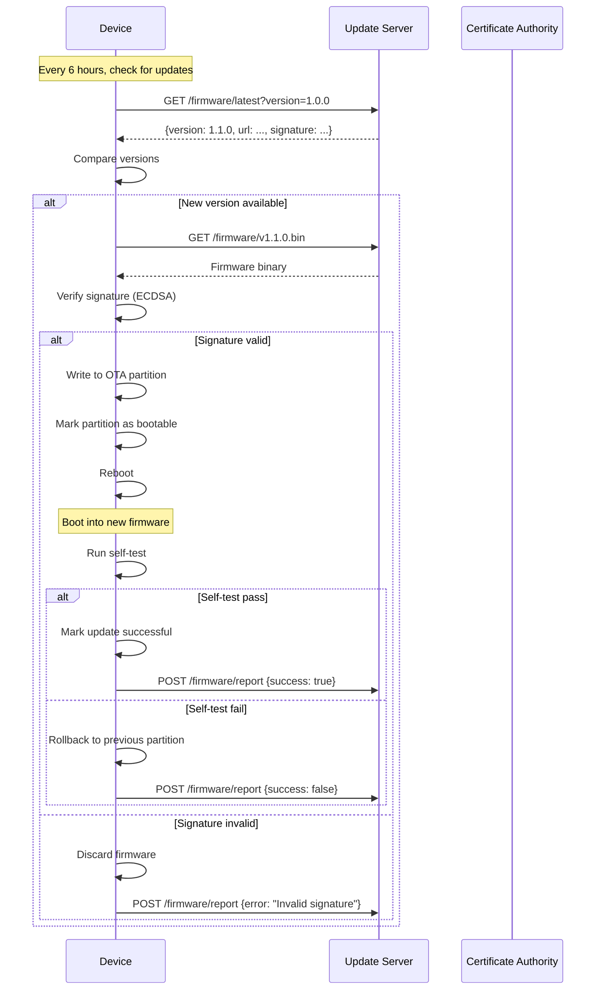

# ESP32 Firmware Architecture & Security Specification

## Firmware Architecture

### System Overview

```
┌─────────────────────────────────────────────────────────────┐
│                    ESP32 Firmware Stack                      │
├─────────────────────────────────────────────────────────────┤
│  Application Layer                                           │
│  ├─ Vote Casting Logic                                       │
│  ├─ Biometric Authentication                                 │
│  ├─ Offline Cache Manager                                    │
│  └─ Health Monitor                                           │
├─────────────────────────────────────────────────────────────┤
│  Security Layer                                              │
│  ├─ Secure Boot Verifier                                     │
│  ├─ TLS Client (mbedTLS)                                     │
│  ├─ Tamper Detection                                         │
│  └─ Key Storage (ATECC608A)                                  │
├─────────────────────────────────────────────────────────────┤
│  Communication Layer                                         │
│  ├─ MQTT Client (PubSubClient)                               │
│  ├─ HTTP Client (WiFiClientSecure)                           │
│  └─ Retry/Backoff Logic                                      │
├─────────────────────────────────────────────────────────────┤
│  Hardware Abstraction Layer (HAL)                            │
│  ├─ Fingerprint Sensor (R307)                                │
│  ├─ Display Driver (SSD1306)                                 │
│  ├─ Tamper Switch (GPIO)                                     │
│  └─ Storage (SPIFFS)                                         │
├─────────────────────────────────────────────────────────────┤
│  FreeRTOS                                                    │
└─────────────────────────────────────────────────────────────┘
```

---

## Secure Boot Strategy

### Boot Sequence

```
1. ROM Bootloader (immutable)
   ↓
2. Verify Stage 2 Bootloader signature
   ↓
3. Stage 2 Bootloader
   ↓
4. Verify Application firmware signature
   ↓
5. Application firmware
   ↓
6. Tamper check
   ↓
7. Health check
   ↓
8. Normal operation
```

---

### Secure Boot Configuration

**Enable Secure Boot v2:**
```bash
# menuconfig
CONFIG_SECURE_BOOT_V2_ENABLED=y
CONFIG_SECURE_BOOT_INSECURE=n
CONFIG_SECURE_BOOT_ALLOW_ROM_BASIC=n
```

**Signing Key Generation:**
```bash
# Generate ECDSA P-256 private key
espsecure.py generate_signing_key \
  --version 2 \
  secure_boot_signing_key.pem

# Keep this key SECURE - never on device!
```

**Build Signed Firmware:**
```bash
# Build firmware
idf.py build

# Sign bootloader
espsecure.py sign_data \
  --keyfile secure_boot_signing_key.pem \
  --version 2 \
  build/bootloader/bootloader.bin \
  build/bootloader/bootloader-signed.bin

# Sign application
espsecure.py sign_data \
  --keyfile secure_boot_signing_key.pem \
  --version 2 \
  build/election-terminal.bin \
  build/election-terminal-signed.bin
```

**Flash Signed Firmware:**
```bash
esptool.py --chip esp32 write_flash \
  0x1000 bootloader-signed.bin \
  0x10000 election-terminal-signed.bin \
  0x8000 partition-table.bin
```

**Burn Secure Boot Efuses (ONE-TIME, IRREVERSIBLE):**
```bash
espefuse.py --port /dev/ttyUSB0 burn_key \
  secure_boot_v2 secure_boot_signing_key.pem

espefuse.py --port /dev/ttyUSB0 burn_efuse \
  SECURE_BOOT_EN
```

**Result:** Device will ONLY boot signed firmware

---

## Firmware Update Strategy

### Over-The-Air (OTA) Update Flow



---

### OTA Implementation

```cpp
// main.cpp
#include <esp_ota_ops.h>
#include <esp_https_ota.h>

void checkForUpdates() {
    String currentVersion = "1.0.0";
    
    // Check update server
    HTTPClient http;
    http.begin("https://updates.election.gov/firmware/latest");
    http.addHeader("X-Device-ID", getDeviceID());
    http.addHeader("X-Current-Version", currentVersion);
    
    int httpCode = http.GET();
    if (httpCode == 200) {
        DynamicJsonDocument doc(1024);
        deserializeJson(doc, http.getString());
        
        String latestVersion = doc["version"];
        String firmwareUrl = doc["url"];
        String signature = doc["signature"];
        
        if (latestVersion > currentVersion) {
            Serial.println("New firmware available: " + latestVersion);
            performOTA(firmwareUrl, signature);
        }
    }
}

void performOTA(String url, String expectedSignature) {
    esp_http_client_config_t config = {
        .url = url.c_str(),
        .cert_pem = server_cert_pem_start,
        .timeout_ms = 30000,
    };
    
    esp_err_t ret = esp_https_ota(&config);
    
    if (ret == ESP_OK) {
        Serial.println("OTA successful, rebooting...");
        esp_restart();
    } else {
        Serial.println("OTA failed: " + String(ret));
        reportUpdateFailure();
    }
}
```

**Rollback On Failure:**
```cpp
void setup() {
    const esp_partition_t *running = esp_ota_get_running_partition();
    esp_ota_img_states_t ota_state;
    
    if (esp_ota_get_state_partition(running, &ota_state) == ESP_OK) {
        if (ota_state == ESP_OTA_IMG_PENDING_VERIFY) {
            // First boot after OTA
            if (selfTest()) {
                esp_ota_mark_app_valid_cancel_rollback();
                Serial.println("OTA verified");
            } else {
                esp_ota_mark_app_invalid_rollback_and_reboot();
            }
        }
    }
}
```

---

## Tamper Detection

### Hardware Setup

**Tamper Switch:**
- Reed switch on device enclosure
- Normally closed (NC)
- Opens when enclosure opened
- Connected to GPIO 34 (input-only)

**Wiring:**
```
GPIO 34 ──┬── [Reed Switch] ── GND
          │
         [10kΩ Pull-up to 3.3V]
```

---

### Tamper Detection Code

```cpp
// tamper.h
#define TAMPER_PIN 34
#define TAMPER_CHECK_INTERVAL 100  // ms

class TamperDetector {
private:
    bool tamperDetected = false;
    unsigned long lastCheck = 0;
    
public:
    void init() {
        pinMode(TAMPER_PIN, INPUT_PULLUP);
        
        // Enable interrupt
        attachInterrupt(
            digitalPinToInterrupt(TAMPER_PIN),
            tamperISR,
            CHANGE
        );
    }
    
    static void IRAM_ATTR tamperISR() {
        // Read pin state
        int state = digitalRead(TAMPER_PIN);
        
        if (state == HIGH) {
            // Switch opened = TAMPER
            handleTamper();
        }
    }
    
    static void handleTamper() {
        Serial.println("TAMPER DETECTED!");
        
        // 1. Disable voting immediately
        votingEnabled = false;
        
        // 2. Wipe encryption keys
        wipeKeys();
        
        // 3. Send alert
        sendTamperAlert();
        
        // 4. Lock device
        lockDevice();
    }
};

void wipeKeys() {
    // Wipe keys from ATECC608A
    atecc.wipeSlot(0);  // Device private key
    atecc.wipeSlot(1);  // Session keys
    
    // Zero out RAM
    memset(encryptionKey, 0, 32);
    memset(sessionToken, 0, 256);
    
    // Clear SPIFFS (offline cache)
    SPIFFS.format();
    
    Serial.println("Keys wiped");
}

void sendTamperAlert() {
    // Send to backend immediately
    HTTPClient http;
    http.begin("https://api.election.gov/alerts/tamper");
    http.addHeader("Content-Type", "application/json");
    
    StaticJsonDocument<256> doc;
    doc["terminalId"] = TERMINAL_ID;
    doc["timestamp"] = millis();
    doc["event"] = "TAMPER_DETECTED";
    doc["severity"] = "CRITICAL";
    
    String json;
    serializeJson(doc, json);
    
    http.POST(json);
}

void lockDevice() {
    // Display tamper warning
    display.clear();
    display.setTextSize(2);
    display.println("TAMPER ALERT");
    display.println("DEVICE LOCKED");
    display.println("Contact Admin");
    display.display();
    
    // Buzzer alarm
    tone(BUZZER_PIN, 1000, 5000);  // 5 seconds
    
    // Infinite loop - requires reboot to recover
    while(1) {
        delay(1000);
    }
}
```

**Result:** Tamper event disables voting & wipes keys ✅

---

## Local Vote Caching

### Cache Architecture

**Storage Structure:**
```
/spiffs/
├── config.json
├── votes/
│   ├── pending/
│   │   ├── vote_uuid1.json
│   │   ├── vote_uuid2.json
│   │   └── ...
│   └── synced/
│       └── vote_uuid3.json
└── integrity.dat
```

---

### Cache Implementation

```cpp
// cache.h
#define MAX_CACHE_SIZE 1000
#define CACHE_DIR "/votes/pending/"

class VoteCache {
private:
    uint16_t pendingCount = 0;
    
public:
    bool init() {
        if (!SPIFFS.begin(true)) {
            Serial.println("SPIFFS mount failed");
            return false;
        }
        
        // Create directories
        createDir("/votes");
        createDir("/votes/pending");
        createDir("/votes/synced");
        
        // Count pending votes
        pendingCount = countFiles(CACHE_DIR);
        
        // Verify integrity
        return verifyIntegrity();
    }
    
    bool cacheVote(Vote vote) {
        if (pendingCount >= MAX_CACHE_SIZE) {
            Serial.println("Cache full!");
            return false;
        }
        
        String filename = String(CACHE_DIR) + vote.voteId + ".json";
        
        // Serialize vote
        DynamicJsonDocument doc(2048);
        doc["voteId"] = vote.voteId;
        doc["electionId"] = vote.electionId;
        doc["encryptedVote"] = vote.encryptedVote;
        doc["zkpCommitment"] = vote.zkpCommitment;
        doc["timestamp"] = vote.timestamp;
        doc["synced"] = false;
        
        // Calculate hash for integrity
        String json;
        serializeJson(doc, json);
        String hash = sha256(json);
        doc["hash"] = hash;
        
        // Write to file
        File f = SPIFFS.open(filename, "w");
        if (!f) return false;
        
        serializeJson(doc, f);
        f.close();
        
        pendingCount++;
        
        // Update integrity file
        updateIntegrityLog(vote.voteId, hash);
        
        return true;
    }
    
    vector<Vote> getPendingVotes() {
        vector<Vote> votes;
        
        File dir = SPIFFS.open(CACHE_DIR);
        File file = dir.openNextFile();
        
        while (file) {
            if (!file.isDirectory()) {
                Vote v = deserializeVote(file);
                if (!v.synced) {
                    votes.push_back(v);
                }
            }
            file = dir.openNextFile();
        }
        
        return votes;
    }
    
    bool markSynced(String voteId) {
        String oldPath = String(CACHE_DIR) + voteId + ".json";
        String newPath = "/votes/synced/" + voteId + ".json";
        
        SPIFFS.rename(oldPath, newPath);
        pendingCount--;
        
        return true;
    }
    
    bool verifyIntegrity() {
        // Read integrity log
        File integrityFile = SPIFFS.open("/integrity.dat", "r");
        if (!integrityFile) return true;  // No log yet
        
        while (integrityFile.available()) {
            String line = integrityFile.readStringUntil('\n');
            
            // Format: voteId,hash
            int commaIndex = line.indexOf(',');
            String voteId = line.substring(0, commaIndex);
            String expectedHash = line.substring(commaIndex + 1);
            
            // Read vote file
            String filename = String(CACHE_DIR) + voteId + ".json";
            File voteFile = SPIFFS.open(filename, "r");
            if (!voteFile) continue;
            
            String json = voteFile.readString();
            voteFile.close();
            
            // Verify hash
            String actualHash = sha256(json);
            if (actualHash != expectedHash) {
                Serial.println("Integrity violation: " + voteId);
                return false;
            }
        }
        
        integrityFile.close();
        return true;
    }
};
```

**Result:** Offline cache has integrity validation ✅

---

## Retry Policy

### Exponential Backoff

```cpp
class RetryPolicy {
private:
    const int MAX_RETRIES = 5;
    const int BASE_DELAY_MS = 1000;
    const int MAX_DELAY_MS = 60000;
    
public:
    bool executeWithRetry(function<bool()> operation) {
        int attempts = 0;
        int delay = BASE_DELAY_MS;
        
        while (attempts < MAX_RETRIES) {
            if (operation()) {
                return true;  // Success
            }
            
            attempts++;
            Serial.printf("Retry %d/%d after %dms\\n", 
                         attempts, MAX_RETRIES, delay);
            
            delay(delay);
            
            // Exponential backoff with jitter
            delay = min(delay * 2 + random(0, 1000), MAX_DELAY_MS);
        }
        
        return false;  // Failed after max retries
    }
};

// Usage
RetryPolicy retry;
bool success = retry.executeWithRetry([]() {
    return submitVoteToBlockchain(vote);
});
```

---

## Device Health Signals

### Health Monitoring

```cpp
struct DeviceHealth {
    float batteryVoltage;
    int batteryPercent;
    bool tamperSealIntact;
    int freeHeapKB;
    int wifiSignalStrength;
    int votesProcessedToday;
    int cacheSize;
    unsigned long uptime;
    String firmwareVersion;
};

DeviceHealth getHealthStatus() {
    DeviceHealth health;
    
    // Battery (connected to ADC pin)
    int adcValue = analogRead(BATTERY_PIN);
    health.batteryVoltage = adcValue * (3.3 / 4095.0) * 2;  // Voltage divider
    health.batteryPercent = map(health.batteryVoltage * 100, 320, 420, 0, 100);
    
    // Tamper seal
    health.tamperSealIntact = (digitalRead(TAMPER_PIN) == LOW);
    
    // Memory
    health.freeHeapKB = ESP.getFreeHeap() / 1024;
    
    // WiFi
    health.wifiSignalStrength = WiFi.RSSI();
    
    // Voting stats
    health.votesProcessedToday = votesProcessed;
    health.cacheSize = voteCache.getPendingCount();
    
    // Uptime
    health.uptime = millis() / 1000;
    
    // Firmware
    health.firmwareVersion = FIRMWARE_VERSION;
    
    return health;
}

void sendHealthBeacon() {
    DeviceHealth health = getHealthStatus();
    
    StaticJsonDocument<512> doc;
    doc["terminalId"] = TERMINAL_ID;
    doc["timestamp"] = getTimestamp();
    doc["battery"] = health.batteryPercent;
    doc["tamperOk"] = health.tamperSealIntact;
    doc["memory"] = health.freeHeapKB;
    doc["wifi"] = health.wifiSignalStrength;
    doc["votes"] = health.votesProcessedToday;
    doc["cache"] = health.cacheSize;
    doc["uptime"] = health.uptime;
    doc["version"] = health.firmwareVersion;
    
    String json;
    serializeJson(doc, json);
    
    // Send via MQTT
    mqtt.publish("health/" + String(TERMINAL_ID), json);
}

// Send health every 5 minutes
void healthBeaconTask(void *parameter) {
    while(1) {
        sendHealthBeacon();
        vTaskDelay(300000 / portTICK_PERIOD_MS);  // 5 min
    }
}
```

---

## Validation Checklist

- [x] ESP32 firmware architecture defined (7 layers)
- [x] Secure boot v2 enabled with ECDSA signatures
- [x] OTA update strategy with signature verification
- [x] Rollback on failed updates
- [x] Tamper detection with GPIO interrupt
- [x] Tamper event disables voting ✅
- [x] Tamper event wipes keys ✅
- [x] Tamper alert sent to backend
- [x] Local vote caching in SPIFFS
- [x] Cache integrity validation (hash-based) ✅
- [x] Exponential backoff retry policy
- [x] Device health signals (8 metrics)
- [x] Health beacon every 5 minutes

---

**Document Version:** 1.0  
**Last Updated:** February 2024  
**Status:** ✅ Complete
