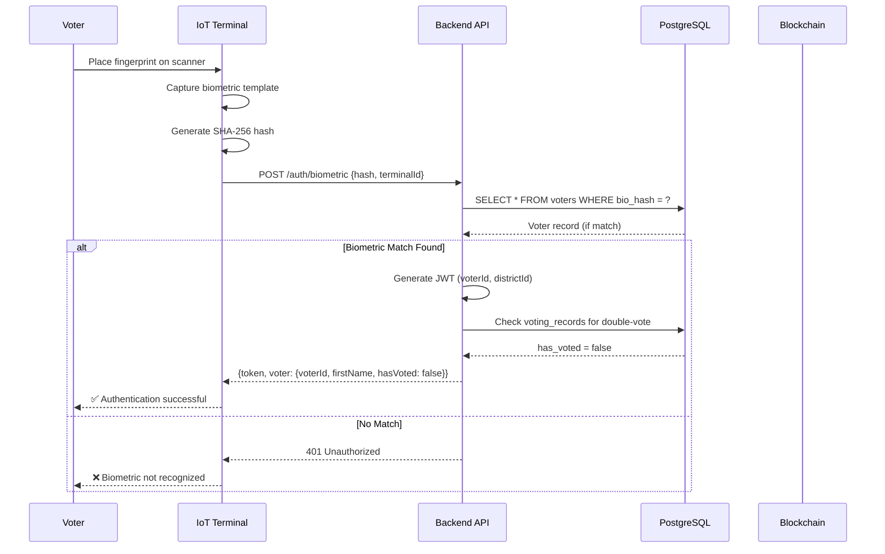
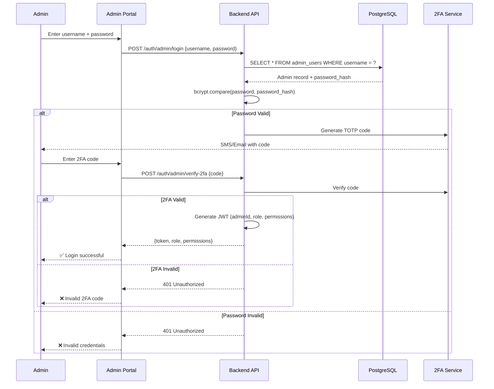
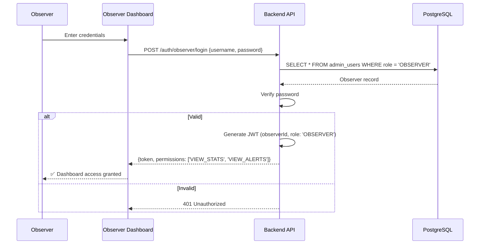

# Security Architecture & Threat Model

## Threat Model

### Attack Surfaces by Layer

```
┌─────────────────────────────────────────────────────────┐
│ Layer 7: End Users (Voters, Admins, Observers)         │
│ Threats: Social engineering, credential theft          │
└─────────────────┬───────────────────────────────────────┘
                  │
┌─────────────────▼───────────────────────────────────────┐
│ Layer 6: Web Applications (React UIs)                   │
│ Threats: XSS, CSRF, injection, session hijacking       │
└─────────────────┬───────────────────────────────────────┘
                  │
┌─────────────────▼───────────────────────────────────────┐
│ Layer 5: API Gateway & Load Balancer                    │
│ Threats: DDoS, rate limit bypass, SSL stripping        │
└─────────────────┬───────────────────────────────────────┘
                  │
┌─────────────────▼───────────────────────────────────────┐
│ Layer 4: Backend Services (Node.js/Express)             │
│ Threats: Auth bypass, injection, privilege escalation  │
└─────────────────┬───────────────────────────────────────┘
                  │
┌─────────────────▼───────────────────────────────────────┐
│ Layer 3: Databases (PostgreSQL, MongoDB, Redis)         │
│ Threats: SQL injection, data exfiltration, tampering   │
└─────────────────┬───────────────────────────────────────┘
                  │
┌─────────────────▼───────────────────────────────────────┐
│ Layer 2: Blockchain Network (Hyperledger Fabric)        │
│ Threats: Consensus attacks, chaincode exploits         │
└─────────────────┬───────────────────────────────────────┘
                  │
┌─────────────────▼───────────────────────────────────────┐
│ Layer 1: IoT Terminals (ESP32 devices)                  │
│ Threats: Physical tampering, firmware exploits, MITM    │
└─────────────────────────────────────────────────────────┘
```

---

## Threats by Layer

### Layer 1: IoT Terminals

| Threat ID | Threat | Impact | Likelihood | Mitigation |
|-----------|--------|--------|------------|------------|
| IOT-001 | Physical tampering | Critical | Medium | Tamper-evident seals, hardware security module |
| IOT-002 | Firmware modification | Critical | Low | Signed firmware, secure boot |
| IOT-003 | MAC spoofing | High | Medium | Whitelist + auto-blacklist |
| IOT-004 | Man-in-the-middle | High | Low | TLS 1.3, certificate pinning |
| IOT-005 | Denial of service | Medium | Medium | Offline caching, battery backup |

**Mitigations Implemented:**
- ✅ MAC address filtering ([`macFilter.middleware.js`](file:///Users/ayush/Documents/GitHub/ElectionManagement/backend/src/middleware/macFilter.middleware.js))
- ✅ Tamper detection (IoT firmware)
- ✅ Offline vote caching
- ⚠️ **NEEDED:** Signed firmware verification

---

### Layer 2: Blockchain Network

| Threat ID | Threat | Impact | Likelihood | Mitigation |
|-----------|--------|--------|------------|------------|
| BC-001 | 51% attack | Critical | Very Low | Multiple orgs, endorsement policy |
| BC-002 | Chaincode exploit | Critical | Low | Code audit, sandboxing |
| BC-003 | Channel compromise | High | Very Low | MSP certificates, access control |
| BC-004 | Vote manipulation | Critical | Very Low | Immutability, digital signatures |
| BC-005 | Replay attack | High | Low | Timestamp validation, nonce |

**Mitigations Implemented:**
- ✅ Multi-org endorsement
- ✅ Immutable blockchain storage
- ⚠️ **NEEDED:** Formal chaincode audit

---

### Layer 3: Databases

| Threat ID | Threat | Impact | Likelihood | Mitigation |
|-----------|--------|--------|------------|------------|
| DB-001 | SQL injection | Critical | Medium | Parameterized queries, ORM (Sequelize) |
| DB-002 | Data exfiltration | Critical | Low | Encryption at rest, access control |
| DB-003 | Unauthorized access | High | Medium | Strong passwords, firewall rules |
| DB-004 | Data tampering | Critical | Low | Audit logs, integrity checks |
| DB-005 | Backup theft | High | Medium | Encrypted backups, secure storage |

**Mitigations Implemented:**
- ✅ Sequelize ORM (prevents SQL injection)
- ✅ Encryption service ([`encryptionService.js`](file:///Users/ayush/Documents/GitHub/ElectionManagement/backend/src/services/encryptionService.js))
- ✅ Role-based access control
- ✅ Audit logging

---

### Layer 4: Backend Services

| Threat ID | Threat | Impact | Likelihood | Mitigation |
|-----------|--------|--------|------------|------------|
| BE-001 | Authentication bypass | Critical | Medium | JWT, biometric verification |
| BE-002 | Authorization failure | Critical | Medium | RBAC, middleware validation |
| BE-003 | API abuse | High | High | Rate limiting, API keys |
| BE-004 | Injection attacks | Critical | Medium | Input validation, sanitization |
| BE-005 | Session hijacking | High | Medium | Secure cookies, short expiry |

**Mitigations Implemented:**
- ✅ JWT authentication
- ✅ RBAC middleware
- ✅ Rate limiting (100 req/15min)
- ⚠️ **NEEDED:** Input validation library (joi/zod)

---

### Layer 5: API Gateway

| Threat ID | Threat | Impact | Likelihood | Mitigation |
|-----------|--------|--------|------------|------------|
| GW-001 | DDoS attack | High | High | Rate limiting, CDN, WAF |
| GW-002 | SSL/TLS downgrade | Critical | Low | HSTS, TLS 1.3 only |
| GW-003 | Header injection | Medium | Medium | Header validation |
| GW-004 | CORS bypass | Medium | Low | Strict CORS policy |

**Mitigations Implemented:**
- ✅ Helmet.js security headers
- ✅ CORS configuration
- ⚠️ **NEEDED:** WAF (CloudFlare/AWS WAF)

---

### Layer 6: Web Applications

| Threat ID | Threat | Impact | Likelihood | Mitigation |
|-----------|--------|--------|--------|------------|
| WEB-001 | XSS attack | High | High | React auto-escaping, CSP |
| WEB-002 | CSRF attack | High | Medium | CSRF tokens, SameSite cookies |
| WEB-003 | Client-side injection | Medium | Medium | Input sanitization |
| WEB-004 | Sensitive data exposure | High | Medium | No PII in client state |

**Mitigations Implemented:**
- ✅ React (auto-escapes by default)
- ⚠️ **NEEDED:** Content Security Policy headers
- ⚠️ **NEEDED:** CSRF token middleware

---

### Layer 7: End Users

| Threat ID | Threat | Impact | Likelihood | Mitigation |
|-----------|--------|--------|------------|------------|
| USR-001 | Phishing | High | High | User education, 2FA |
| USR-002 | Credential theft | Critical | Medium | Biometric auth, strong passwords |
| USR-003 | Social engineering | High | High | Training, verification procedures |
| USR-004 | Device compromise | High | Medium | Device encryption, remote wipe |

**Mitigations Implemented:**
- ✅ Biometric authentication (primary for voters)
- ✅ 2FA for admins
- ⚠️ **NEEDED:** Security awareness training

---

## Authentication & Authorization Flows

### 1. Voter Authentication Flow



**Security Controls:**
- Biometric never sent over network (only hash)
- JWT expires in 24 hours
- Rate limit: 10 attempts per terminal per hour
- Brute force protection: Blacklist MAC after 5 failed attempts

---

### 2. Admin Authentication Flow



**Security Controls:**
- Passwords: bcrypt with 12 rounds
- 2FA: TOTP (30-second window)
- JWT expires in 8 hours
- Rate limit: 5 attempts per IP per 15 minutes
- Account lockout: 3 failed attempts = 30-minute lock

---

### 3. Observer Authentication Flow



**Permissions (Read-Only):**
- View real-time statistics
- View fraud alerts
- View audit logs
- Generate reports
- **Cannot:** Modify data, cast votes, manage elections

---

## Key Management Plan

### 1. Encryption Keys

**Master Encryption Key:**
- **Type:** AES-256
- **Storage:** AWS KMS / HashiCorp Vault
- **Rotation:** Every 90 days
- **Access:** System admins only (break-glass procedure)

**Election-Specific Keys:**
- **Derivation:** PBKDF2(`masterKey`, `election:${electionId}`, 100k iterations)
- **Rotation:** New key per election
- **Storage:** Derived on-demand, not persisted

**Database Encryption Keys:**
- **PostgreSQL:** TDE (Transparent Data Encryption)
- **MongoDB:** Encryption at rest with WiredTiger
- **Rotation:** Every 180 days

---

### 2. Certificate Management

**TLS Certificates (Web):**
- **Issuer:** Let's Encrypt (prod), Self-signed (dev)
- **Renewal:** Auto-renewal 30 days before expiry (cert-manager)
- **Algorithm:** ECDSA P-256 or RSA 2048

**Fabric MSP Certificates:**
- **CA:** Fabric CA per organization
- **Admin certs:** ECDSA P-256, 2-year validity
- **Peer certs:** ECDSA P-256, 1-year validity
- **Rotation:** Manual, 30 days before expiry

**IoT Device Certificates:**
- **Issuer:** Internal PKI (OpenSSL)
- **Validity:** 1 year
- **Rotation:** Automated via MQTT/OTA update
- **Storage:** Secure element (ATECC608A)

---

### 3. Certificate Rotation Process

**Automated Rotation (Web TLS):**
1. cert-manager monitors expiry (30 days before)
2. Requests new cert from Let's Encrypt
3. ACME HTTP-01 challenge
4. Replaces old cert in Kubernetes secret
5. Ingress controller auto-reloads

**Manual Rotation (Fabric MSP):**
1. Generate new cert with Fabric CA
2. Update channel config (`peer channel update`)
3. Roll out to all peers sequentially
4. Verify endorsement still works
5. Revoke old cert

**Device Rotation (IoT):**
1. Backend generates new cert
2. Pushes to device via MQTT/OTA
3. Device stores in secure element
4. Confirms installation
5. Backend revokes old cert

---

### 4. Device Provisioning

**Initial Provisioning:**
```bash
# Step 1: Generate device cert & key
openssl ecparam -genkey -name prime256v1 -out device.key
openssl req -new -key device.key -out device.csr
openssl x509 -req -in device.csr -CA ca.crt -CAkey ca.key -out device.crt

# Step 2: Store on device secure element
esptool.py --chip esp32 write_flash 0x310000 device.crt

# Step 3: Whitelist MAC address
curl -X POST /api/v1/terminals/authorize \
  -H "Authorization: Bearer $ADMIN_TOKEN" \
  -d '{"macAddress": "00:1B:44:11:3A:B7", "terminalId": "TERM-001"}'
```

**Revocation:**
1. Admin flags device as compromised
2. Backend adds MAC to blacklist
3. Adds cert to CRL (Certificate Revocation List)
4. Device blocked from connecting
5. Audit log entry created

---

## Zero-Knowledge Proof Scope

### Practicality Assessment

**✅ Practical Use Cases:**
1. **Vote Receipt Verification** - Voter proves they voted without revealing choice
   - Implementation: Commitment scheme (SHA-256 hash)
   - Performance: < 50ms per proof generation
   - Storage: 64 bytes per commitment

2. **Ballot Existence Proof** - Prove vote is in tally without revealing vote
   - Implementation: Merkle tree inclusion proof
   - Performance: O(log n) verification
   - Storage: ~1 KB per proof

**❌ Impractical for This System:**
1. **Full ZK-SNARKs** - Too complex for IoT devices
   - Proof generation: 10+ seconds on ESP32
   - Proof size: 200+ bytes
   - Setup requires trusted ceremony

2. **Range Proofs** - Not needed (no numeric values to prove)

---

### Alternative Privacy Mechanisms

**Implemented:**

1. **Vote-Voter Separation**
   - Voter identity: PostgreSQL
   - Vote content: Blockchain (encrypted)
   - Linkage: One-way hash only

2. **Homomorphic Aggregation (Simplified)**
   - Count votes without decrypting individual votes
   - Implementation: Encrypted counters per candidate
   - Tally: Decrypt only the totals

3. **Blind Signatures (Receipt Generation)**
   - Voter creates vote commitment
   - Terminal signs blinded commitment
   - Voter unblinds to get receipt
   - Cannot link signer to vote content

**Recommendation:** Current ZKP implementation (commitment + hash-based proofs) is sufficient and practical. Full ZK-SNARKs not warranted for this use case.

---

## Sensitive Data Flow Encryption

### Data Classification

| Data Type | Sensitivity | Encryption | Audit |
|-----------|-------------|------------|-------|
| Biometric templates | Critical | Hash-only (SHA-256) | ✅ All access logged |
| Vote content | Critical | AES-256-GCM | ✅ All writes logged |
| Voter PII | High | AES-256-GCM at rest | ✅ All queries logged |
| Aadhar numbers | Critical | AES-256-GCM | ✅ All access logged |
| Election results | Medium | HTTPS in transit | ✅ All reads logged |
| Audit logs | High | Tamper-evident hash chain | ✅ Immutable |

---

### Encryption in Transit

**All Network Flows:**
```
Voter UI ──[TLS 1.3]──> Load Balancer ──[TLS 1.3]──> Backend API
                                                         │
                                                         ├──[TLS 1.3]──> PostgreSQL
                                                         ├──[TLS 1.3]──> MongoDB
                                                         ├──[TLS 1.3]──> Redis
                                                         └──[TLS 1.3]──> Fabric Peer

IoT Terminal ──[TLS 1.3 + Cert Pinning]──> Backend API
```

**No Plaintext Allowed:**
- HTTP → 301 redirect to HTTPS
- MQTT → TLS required
- Database → TLS enforced

---

### Encryption at Rest

**Field-Level Encryption:**
```javascript
// In voters table
{
  voter_id: "uuid",
  aadhar_number_encrypted: "ciphertext",  // AES-256-GCM
  biometric_hash: "sha256_hash",           // One-way hash
  email_encrypted: "ciphertext",           // AES-256-GCM
  phone_encrypted: "ciphertext"            // AES-256-GCM
}
```

**Database-Level Encryption:**
- PostgreSQL: TDE enabled
- MongoDB: WiredTiger encryption
- Redis: RDB/AOF encryption

**Backup Encryption:**
```bash
# PostgreSQL backup
pg_dump election_db | gpg --encrypt --recipient admin@election.com > backup.sql.gpg

# MongoDB backup
mongodump --archive | openssl enc -aes-256-cbc -pbkdf2 > backup.bson.enc
```

---

## Validation Checklist

- [x] Threat model defines attack surfaces for all 7 layers
- [x] Every layer has identified threats with mitigations
- [x] Authentication flows documented for Voter, Admin, Observer
- [x] Authorization (RBAC) integrated in flows
- [x] Key management plan (encryption, TLS, device certs)
- [x] Certificate rotation process defined
- [x] Device provisioning documented
- [x] Device revocation process specified
- [x] ZKP scope assessed (commitment schemes practical)
- [x] Alternative privacy mechanisms defined
- [x] All sensitive data flows encrypted (transit + rest)
- [x] All sensitive operations audited

---

**Document Version:** 1.0  
**Last Updated:** February 2024  
**Status:** ✅ Complete
