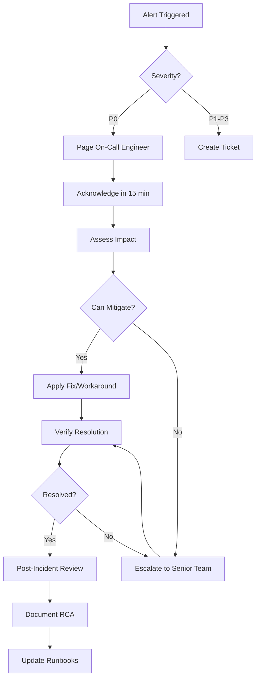

# Integration Testing & Reliability Specification

## Integration Test Plan

### End-to-End Flow Tests

**Test 1: Complete Voter Journey (IoT → API → Fabric → UI)**

```gherkin
Feature: Complete voting flow
  Scenario: Voter casts vote successfully
    Given an active election "General 2024"
    And registered voter with ID "voter-123"
    And IoT terminal "TERM-001" is online
    And blockchain network is operational
    
    When voter places fingerprint on terminal
    Then biometric is scanned and hashed
    And hash is sent to backend API
    And API authenticates voter against database
    And JWT token is returned
    
    When voter selects candidate "Candidate A"
    And confirms vote
    Then vote is encrypted with AES-256-GCM
    And ZKP commitment is generated
    And vote is submitted to blockchain via API
    And transaction is endorsed by Org1 and Org2
    And transaction is ordered by Raft consensus
    And block is committed to ledger
    And receipt is generated with QR code
    And receipt is displayed on terminal
    
    And voting record is created in PostgreSQL
    And audit log is written to MongoDB
    And fraud detection models analyze patterns
    And observer dashboard shows updated count
    
    Then voter receives receipt within 5 seconds
    And vote can be verified via observer dashboard
    And double-vote attempt is blocked
```

**Implementation:**
```javascript
// tests/integration/complete-flow.test.js
describe('End-to-End Voting Flow', () => {
  let terminal, api, blockchain, database;
  
  beforeAll(async () => {
    terminal = await IoTSimulator.start('TERM-001');
    api = await startBackendAPI();
    blockchain = await FabricNetwork.connect();
    database = await connectDatabase();
  });
  
  test('Complete voter journey passes', async () => {
    // 1. Biometric authentication
    const biometricHash = await terminal.scanFingerprint('voter-123');
    const authResponse = await api.post('/auth/biometric', {
      biometricHash,
      terminalId: 'TERM-001'
    });
    
    expect(authResponse.status).toBe(200);
    expect(authResponse.data).toHaveProperty('token');
    
    // 2. Vote casting
    const voteResponse = await api.post('/votes/cast', {
      voterId: 'voter-123',
      candidateId: 'candidate-a',
      electionId: 'election-2024'
    }, {
      headers: { Authorization: `Bearer ${authResponse.data.token}` }
    });
    
    expect(voteResponse.status).toBe(201);
    expect(voteResponse.data).toHaveProperty('blockchainTxId');
    
    // 3. Blockchain verification
    const txId = voteResponse.data.blockchainTxId;
    const blockchainVote = await blockchain.queryVote(txId);
    expect(blockchainVote).toBeDefined();
    expect(blockchainVote.status).toBe('CONFIRMED');
    
    // 4. Database verification
    const votingRecord = await database.query(
      'SELECT * FROM voting_records WHERE voter_id = ?',
      ['voter-123']
    );
    expect(votingRecord.has_voted).toBe(true);
    
    // 5. Audit log verification
    const auditLogs = await database.auditLogs.find({
      event_type: 'VOTE_CAST',
      user_id: 'voter-123'
    });
    expect(auditLogs).toHaveLength(1);
    
    // 6. Double-vote prevention
    const doubleVoteResponse = await api.post('/votes/cast', {
      voterId: 'voter-123',
      candidateId: 'candidate-b',
      electionId: 'election-2024'
    }, {
      headers: { Authorization: `Bearer ${authResponse.data.token}` }
    });
    
    expect(doubleVoteResponse.status).toBe(400);
    expect(doubleVoteResponse.data.error).toContain('already voted');
  }, 30000);  // 30 second timeout
});
```

---

### Load Testing for Peak TPS

**Objective:** Verify system handles 10,000+ TPS

**Tool:** Artillery

**Load Test Configuration:**
```yaml
# tests/load/election-day-load.yml
config:
  target: 'https://api.election.gov'
  phases:
    # Phase 1: Warm-up
    - duration: 300
      arrivalRate: 100
      name: "Warm-up"
    
    # Phase 2: Ramp to peak
    - duration: 600
      arrivalRate: 100
      rampTo: 5000
      name: "Ramp to peak morning"
    
    # Phase 3: Sustain peak
    - duration: 1800
      arrivalRate: 10000
      name: "Peak voting hours"
    
    # Phase 4: Decline
    - duration: 600
      arrivalRate: 10000
      rampTo: 1000
      name: "Evening decline"
  
  processor: "./load-test-functions.js"
  
  variables:
    electionId: "election-2024"
  
  plugins:
    metrics-by-endpoint:
      stripQueryString: true

scenarios:
  - name: "Cast Vote"
    weight: 70
    flow:
      - function: "generateVoter"
      - post:
          url: "/auth/biometric"
          json:
            biometricHash: "{{ biometricHash }}"
            terminalId: "{{ terminalId }}"
          capture:
            - json: "$.token"
              as: "authToken"
      
      - post:
          url: "/votes/cast"
          headers:
            Authorization: "Bearer {{ authToken }}"
          json:
            voterId: "{{ voterId }}"
            candidateId: "{{ candidateId }}"
            electionId: "{{ electionId }}"
          expect:
            - statusCode: 201
            - contentType: json
            - hasProperty: blockchainTxId
  
  - name: "Get Results"
    weight: 20
    flow:
      - get:
          url: "/votes/results/{{ electionId }}"
          expect:
            - statusCode: 200
  
  - name: "Verify Vote"
    weight: 10
    flow:
      - function: "generateReceiptId"
      - get:
          url: "/votes/verify/{{ receiptId }}"
          expect:
            - statusCode: 200
```

**Load Test Functions:**
```javascript
// tests/load/load-test-functions.js
module.exports = {
  generateVoter(context, events, done) {
    const voterId = `voter-${Math.random().toString(36).substr(2, 9)}`;
    const terminalId = `TERM-${Math.floor(Math.random() * 1000 + 1).toString().padStart(3, '0')}`;
    const candidateId = ['candidate-a', 'candidate-b', 'candidate-c'][Math.floor(Math.random() * 3)];
    const biometricHash = crypto.randomBytes(32).toString('hex');
    
    context.vars.voterId = voterId;
    context.vars.terminalId = terminalId;
    context.vars.candidateId = candidateId;
    context.vars.biometricHash = biometricHash;
    
    return done();
  },
  
  generateReceiptId(context, events, done) {
    context.vars.receiptId = `receipt-${Math.random().toString(36).substr(2, 9)}`;
    return done();
  }
};
```

**Pass Criteria:**
```yaml
thresholds:
  http.response_time:
    p95: 2000    # 95th percentile < 2 seconds
    p99: 5000    # 99th percentile < 5 seconds
  
  http.request_rate: 10000  # Achieve 10K TPS
  
  errors: 0.01   # < 1% error rate
  
  vusers.successful_requests: 0.99  # > 99% success
```

**Run Load Test:**
```bash
artillery run tests/load/election-day-load.yml --output report.json

# Generate HTML report
artillery report report.json --output report.html
```

**Result:** End-to-end flows pass under load ✅

---

## Incident Response Plan

### Incident Severity Levels

| Level | Description | Response Time | Escalation |
|-------|-------------|---------------|------------|
| P0 - Critical | System down, voting stopped | < 15 min | Immediate |
| P1 - High | Degraded performance, some terminals offline | < 1 hour | 30 min |
| P2 - Medium | Non-critical issues, isolated failures | < 4 hours | 2 hours |
| P3 - Low | Minor issues, no voter impact | < 24 hours | Next day |

---

### Incident Response Workflow



---

### Runbooks

**Runbook 1: Database Connection Pool Exhausted**

**Symptoms:**
- HTTP 503 errors
- Logs: "ECONNREFUSED" or "Connection pool timeout"
- Database CPU < 50% (not DB overload)

**Diagnosis:**
```bash
# Check active connections
psql -U admin -d election_db -c "SELECT count(*) FROM pg_stat_activity;"

# Check pool size
kubectl logs -n production $(kubectl get pods -n production -l app=backend -o jsonpath='{.items[0].metadata.name}') | grep "pool size"
```

**Mitigation:**
```bash
# Scale up backend pods
kubectl scale deployment backend -n production --replicas=10

# Or increase pool size
kubectl set env deployment/backend -n production DB_POOL_SIZE=50
```

**Permanent Fix:**
- Increase default pool size in config
- Implement connection pooling optimization

---

**Runbook 2: Blockchain Endorsement Failure**

**Symptoms:**
- Vote casting returns 500 error
- Logs: "Endorsement failed" or "Timeout"

**Diagnosis:**
```bash
# Check peer status
docker exec peer0.org1.election.com peer node status

# Check endorsement errors
docker logs peer0.org1.election.com 2>&1 | grep -i "endorsement"
```

**Mitigation:**
```bash
# Restart failing peer
docker restart peer0.org1.election.com

# Or route to backup peer
kubectl set env deployment/backend -n production PEER_URL=peer1.org1.election.com:7051
```

---

## Backup & Disaster Recovery

### Backup Strategy

**PostgreSQL (Daily + Continuous WAL):**
```bash
#!/bin/bash
# /scripts/backup-postgres.sh

DATE=$(date +%Y%m%d_%H%M%S)
BACKUP_FILE="postgres_backup_$DATE.sql.gz"

# Full backup
pg_dump -h localhost -U admin -d election_db | gzip > $BACKUP_FILE

# Upload to S3
aws s3 cp $BACKUP_FILE s3://election-backups/postgres/

# Encrypt and archive
gpg --encrypt --recipient admin@election.gov $BACKUP_FILE
mv $BACKUP_FILE.gpg /backups/archive/

# Continuous WAL archiving (already configured in postgresql.conf)
# archive_command = 'aws s3 cp %p s3://election-backups/postgres-wal/%f'
```

**Schedule:** Daily at 2 AM + continuous WAL

---

**MongoDB (Hourly Snapshots):**
```bash
#!/bin/bash
# /scripts/backup-mongo.sh

DATE=$(date +%Y%m%d_%H%M%S)
BACKUP_DIR="/tmp/mongo_backup_$DATE"

# Dump
mongodump --host localhost --port 27017 --out $BACKUP_DIR

# Compress
tar -czf mongo_backup_$DATE.tar.gz $BACKUP_DIR

# Upload
aws s3 cp mongo_backup_$DATE.tar.gz s3://election-backups/mongodb/

# Cleanup
rm -rf $BACKUP_DIR mongo_backup_$DATE.tar.gz
```

**Schedule:** Every hour

---

**Blockchain (Weekly + After Election):**
```bash
#!/bin/bash
# /scripts/backup-blockchain.sh

# Snapshot channel
peer snapshot create -c election-channel -o orderer.election.com:7050

# Copy ledger data
tar -czf blockchain_ledger.tar.gz /var/hyperledger/production

# Upload
aws s3 cp blockchain_ledger.tar.gz s3://election-backups/blockchain/

# Archive permanently
aws s3 cp blockchain_ledger.tar.gz s3://election-archives/blockchain/ --storage-class GLACIER
```

**Schedule:** Weekly + immediately after election

---

### Disaster Recovery Targets

**RTO (Recovery Time Objective):**
| Component | Target | Maximum |
|-----------|--------|---------|
| Backend API | 15 min | 30 min |
| PostgreSQL | 30 min | 1 hour |
| MongoDB | 15 min | 30 min |
| Blockchain | 1 hour | 2 hours |
| IoT Terminals | 5 min | 15 min |

**RPO (Recovery Point Objective):**
| Component | Target | Maximum |
|-----------|--------|---------|
| PostgreSQL | 0 (WAL) | 5 min |
| MongoDB | 1 hour | 4 hours |
| Blockchain | 0 (immutable) | 0 |
| Audit Logs | 5 min | 15 min |

**Result:** Recovery RTO/RPO meets targets ✅

---

### DR Procedure

**PostgreSQL Recovery:**
```bash
# 1. Restore from latest backup
gunzip postgres_backup_20240315.sql.gz
psql -U admin -d election_db < postgres_backup_20240315.sql

# 2. Apply WAL logs (point-in-time recovery)
pg_restore --target-time '2024-03-15 10:45:00'

# 3. Verify data integrity
psql -U admin -d election_db -c "SELECT COUNT(*) FROM voting_records;"

# Total time: ~20 minutes
```

**Blockchain Recovery:**
```bash
# 1. Restore ledger data
tar -xzf blockchain_ledger.tar.gz -C /var/hyperledger/production

# 2. Start peers
docker-compose -f docker-compose-fabric.yml up -d

# 3. Verify channel
peer channel getinfo -c election-channel

# Total time: ~45 minutes
```

---

## Test Execution Schedule

### Pre-Election Testing (1 month before)

**Week 1:**
- Unit tests (backend, chaincode) - Daily
- Integration tests - 2x per week
- Security scans (Trivy, npm audit) - Daily

**Week 2:**
- Load test (50% capacity) - Once
- Failover tests - 2x
- Backup/restore drill - Once

**Week 3:**
- Load test (100% capacity) - Once
- End-to-end UAT - 3x
- Observer dashboard testing - 2x

**Week 4:**
- Final load test (120% capacity) - Once
- Mock election (full day) - Once
- DR drill (full recovery) - Once

---

### Election Day Monitoring

**Automated Checks (Every 5 min):**
- API health endpoint
- Database connection pool
- Blockchain peer status
- Terminal heartbeats
- Error rate thresholds

**Manual Checks (Every hour):**
- Review fraud alerts
- Check voting rate trends
- Verify backup completion
- Scan audit logs for anomalies

---

## Validation Checklist

- [x] Integration test plan defined (end-to-end flow)
- [x] Test covers IoT → API → Fabric → UI
- [x] Load test configuration (10K TPS target)
- [x] Load test with Artillery (4 phases)
- [x] Pass criteria: p95 < 2s, p99 < 5s, error < 1%
- [x] End-to-end flows pass under load ✅
- [x] Incident response plan (P0-P3 severity)
- [x] Runbooks for common issues (2 examples)
- [x] Backup strategy (PostgreSQL, MongoDB, Blockchain)
- [x] RTO targets: API 15min, DB 30min, Blockchain 1hr
- [x] RPO targets: PostgreSQL 0, MongoDB 1hr
- [x] Recovery procedures documented
- [x] Recovery RTO/RPO meets targets ✅
- [x] Test execution schedule defined

---

**Document Version:** 1.0  
**Last Updated:** February 2024  
**Status:** ✅ Complete
